## 6.1 Lesson Plan - APIs

### Overview

Today's lesson introduces students to JSON traversal and the fundamentals of making API requests with the [requests library](http://docs.python-requests.org/en/master/), using the [OMDb](https://www.omdbapi.com/) and [New York Times](https://developer.nytimes.com/) APIs.

### Instructor Notes

* The NYT API imposes rate limits on requests. It shouldn't interfere with instructor demonstrations or student exercises, but be aware of it as a potential source of errors.

* You will need to provide your own unique NYT API key for the instructor demonstration and the student activity.

* Due to stricter policies set in place by Twitter, students will create their Twitter developer accounts at the end of class today. This provides ample time for them to receive their API tokens prior to the start of Unit 7.

### Sample Class Video (Highly Recommended)

* To view an example class lecture visit (Note video may not reflect latest lesson plan): [Class Video](https://codingbootcamp.hosted.panopto.com/Panopto/Pages/Viewer.aspx?id=a1e23a53-a5c1-4d82-8dcf-8fcc92ceaf38)

- - -

### Class Objectives

* Students will be able to make GET requests with `requests`.

* Students will be able to convert JSON into a Python dictionary.

* Students will read and apply API documentation.

* Students will sign up for and use an API key.

- - -

### 1. Instructor Do: Intro to APIs (0:05)

* Welcome the class and let them know that the today's lesson will focus on making API calls.

* Slack out the [Student Guide](../StudentGuide.md) for students to use as a reference as they advance through this week's activities.

* Take a moment to review the concepts of _client_ and _server_.

  * Explain that a **client** is the application/device that _asks_ for information.

  * Explain that a **server** is a computer that _supplies_ the information to the client.

  * As an analogy, give the example of a doctor asking for a patient's medical records. The doctor _requests_ information, so they are the **client** in this case. The hospital _provides_ the information and thus could be seen as the **server**. The medical records themselves are the _information_ requested.

* Share the [API call diagram](Images/01-APIIntro_Diagram.png) to provide an illustration of the concept.

  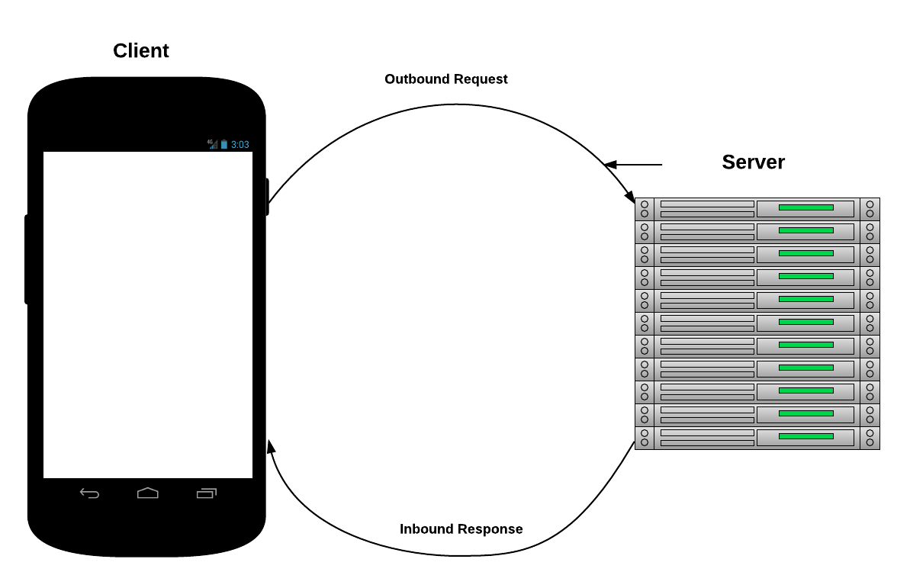

  * Point out how, in the diagram, the client only _requests_ information, which the server then provides.

  * Explain that an API call that focuses on retrieving data is called a get request and that API stands for **A**pplication **P**rogramming **I**nterface.

  * There are other ways for clients to interact with servers but that these methods are not necessary for today's activities.

  * API calls are not all that different than simply visiting a website manually. They point to a URL and collect some data from the page.

* Visit the [JSON Placeholder page](https://jsonplaceholder.typicode.com/posts/) and explain the contents of the webpage to the class.

  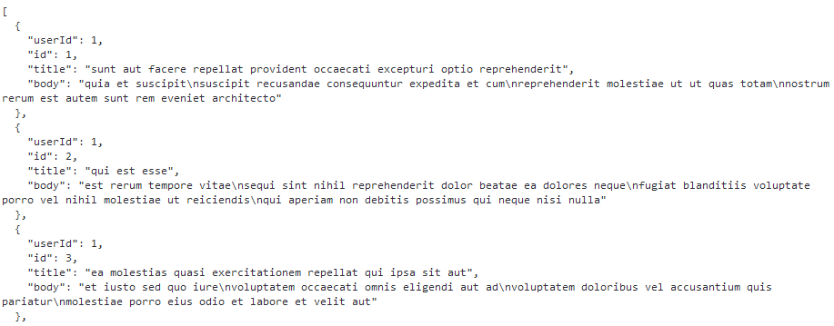

  * This webpage acts as an example of a JSON file that would be returned by an API call. Tell students not to worry about the formatting or syntax of this object at the moment.

  * The URL is no different from the URLs students are used to using to visit "normal" websites.

  * Explain that the URLs used to communicate with APIs are often called **endpoints**.

  * Explain that the text inside of the web browser is _identical_ to what a client script would receive when making a call to this endpoint.

* Point out that API calls must be sent through the Internet and, as such, special tools are required to make them.

  * Explain that the de facto standard library for making API calls in Python is [requests.py](http://docs.python-requests.org/en/master/)

* Before the next activity, you may want to direct students to a JSON formatter extension offered by the Chrome Web Store: <https://chrome.google.com/webstore/search/json%20formatter>.

### 2. Instructor Do: Intro to Requests (0:05)

* Open [01-Ins_RequestsIntro/Ins_Requests_Demo.ipynb](Activities/01-Ins_RequestsIntro/Solved/Ins_Requests_Demo.ipynb) in Jupyter Notebook and go through the code with the class.

  * `import requests` to pull the Requests library into Python. This will allow the code to make API calls and collect data from a server.

  * `import json` allows Python to pull in and parse JSON objects.

  * The `url` variable contains the SpaceX URL that the class visited within a string.

  * Explain that `requests.get(url)` sends a GET request to the URL passed as a parameter. Remind students that this means that the program is _requesting_ the information stored at this URL.

    

  * Explain that `requests.get(url)` returns a response object containing much information about the server's response, but does not seem to include the JSON requested.

    

  * The `.json()` call must be used to convert the response object received into the JSON format seen earlier in the browser.

  * Point out how the JSON response is contained within one massive block of text. This makes it very hard to understand or read through. To counteract this, the `json.dumps()` method can be used to "pretty print" the response.

    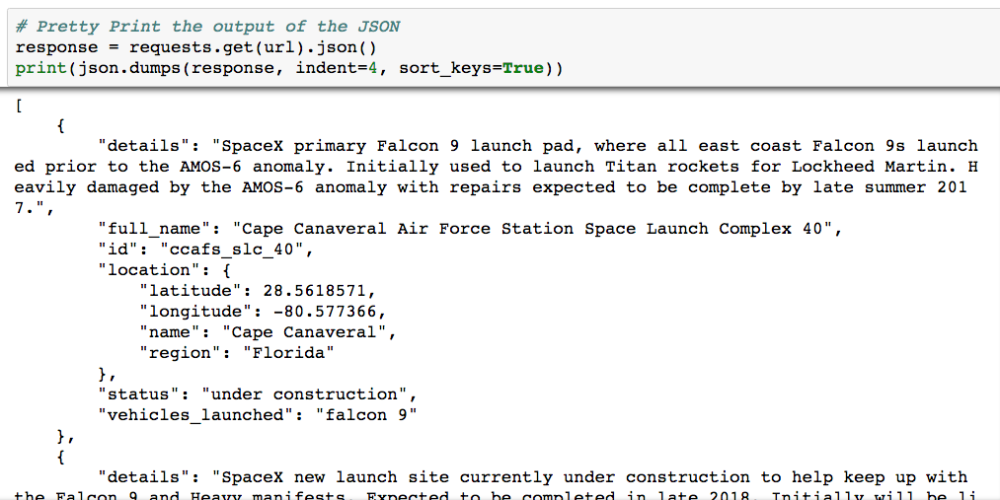

### 3. Students Do: Requesting SpaceX (0:10)

* This activity has students dig into a rather simple and well-documented API - The SpaceX API - and asks them to make a couple calls to the API using the Requests library.

* Open up [02-Stu_SpaceX/Stu_SpaceX.ipynb](Activities/02-Stu_SpaceX/Solved/Stu_SpaceX.ipynb) in Jupyter Notebook or show the students the following image to give them an idea of how the output should look.

  

* **File:** [02-Stu_SpaceX/Stu_SpaceX.ipynb](Activities/02-Stu_SpaceX/Unsolved/Stu_SpaceX.ipynb)

* **Instructions:** [Activities/02-Stu_SpaceX/README.md](Activities/02-Stu_SpaceX/README.md)

  * Take a few minutes to explore the SpaceX API: <https://github.com/r-spacex/SpaceX-API/wiki>

  * Once you understand the structure of the API and its endpoint, choose one of the endpoints and do the following:

  * Retrieve and print the JSON for _all_ of the records from your chosen endpoint.

  * Retrieve and print the JSON for a _specific_ record from your chosen endpoint.

### 4. Everyone Do: Requesting SpaceX Review (0:05)

* Open up [02-Stu_SpaceX/Stu_SpaceX.ipynb](Activities/02-Stu_SpaceX/Solved/Stu_SpaceX.ipynb) in Jupyter Notebook and run through the code with the class line-by-line, making certain to hit upon the following points.

  * While it is not required to "pretty print" the JSON response, it does make it a lot easier to understand. This means using `json.dumps()` and passing the formatting parameters desired.

    

  * To modify an API call to search for a single ID, use concatenation or string substitution to build the correct URL.  Here,   it is done in the `requests.get()` method.

    

### 5. Instructor Do: Manipulating Responses (0:05)

* Point out that the solution to the previous activity used the API responses immediately by printing the JSON to the screen.

* The JSON response can be saved within a variable, however, allowing the application to refer to the dictionary multiple times and inspect its properties.

  * JSON is structurally similar to Python's dictionaries as both of these data formats use "key" and "value" pairings.

* Open [03-Ins_ManipulatingResponses/Ins_Manipulating_JSON.ipynb](Activities/03-Ins_ManipulatingResponses/Solved/Ins_Manipulating_JSON.ipynb) within an IDE and run through the code with the class.

  * So long as a response has been parsed using `response.json()` it becomes possible to navigate through and collect values like one would a dictionary.

    

  * Point out how the application accesses the value stored within the "cost_per_launch" key using `["cost_per_launch"]`.

    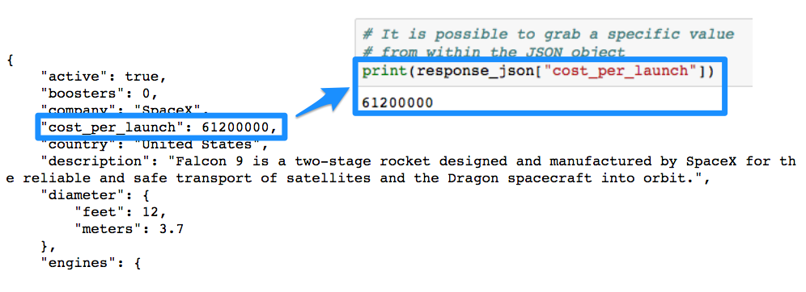

  * Both Python dictionaries and JSON objects can contain dictionaries within dictionaries. To access the data stored within these sub-dictionaries, simply pass the parent key within brackets and then follow it up with the child key in a second set of brackets. In this case, since there is an array of sub-dictionaries, you must also use the index of the subdictionary before passing the child key.

    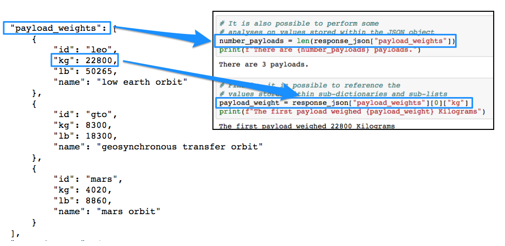

### 6. Students Do: Requesting a Galaxy Far Far Away (0:15)

* Students will now create an application that accesses data from the Star Wars API and prints out values from within it.

* Show students the following images to demonstrate the goal for this activity, explain the directions, and slack them out to students.

  

* **File:**

  * [Stu_FarFarAway.ipynb](Activities/04-Stu_FarFarAway/Unsolved/Stu_FarFarAway.ipynb)

* **Instructions:** [04-Stu_FarFarAway/README.md](Activities/04-Stu_FarFarAway/README.md)

  * Using the starter file provided, collect the following pieces of information from the Star Wars API.

  * The name of the character

  * The number of films they were in

  * The name of their first starship

  * Once the data has been collected, print it out to the console.

* **Hints:**

  * It would be in the programmer's best interest to print out the JSON from the initial request before anything else. This will let them know what keys they should reference.

  * The "starship" values are links to another API call. This means that the programmer will need to create a request based off of the values of a previous request.

* **Bonus:**

  * Come up with a way in which to collect and print out all of the film names a character was in.

### 7. Everyone Do: Review Far Far Away (0:05)

* Open up [04-Stu_FarFarAway/Stu_FarFarAway.ipynb](Activities/04-Stu_FarFarAway/Solved/Stu_FarFarAway.ipynb) in Jupyter Notebook and run through the code with the class line-by-line, making certain to hit upon the following points.

  * Printing out the original JSON is critical to understanding what keys and values an application should collect. It is also a crucial part of what is known as "Test Driven Development" as it allows the programmer to know what their outputs should be.

  

  * To collect the character's name, reference the `["name"]` key and store it within a variable for later.

  * To collect the number of films a character has been in, reference the `["films"]` key and collect the length of the list it returns.

  * To collect the name of the character's first starship, reference the `["starships"]` key and the value at the index of `[0]`. This returns a URL to use in a second API call. The name of the starship will be held within the `["name"]` key of this JSON object.

    

* Ask the class how they would go about solving the bonus.

  * Loop through the `["films"]` list and run an API call for each value within the list. Then, from the JSON returned, collect the `["title"]` and append them into a list.

  

### 8. Partners Do: Number Facts (0:20)

* Students will now join forces in creating an interactive application that uses the "numbers" API. The application will take in a number and then return a random fact about that number.

* Open up [05-Par_NumberFacts/Par_NumberFacts.ipynb](Activities/05-Par_NumberFacts/Solved/Par_NumberFacts.ipynb) in Jupyter Notebook and run the application, showing students what they will be attempting to create or show them the image below.

  

* **File:**

  * [05-Par_NumberFacts/Par_NumberFacts.ipynb](Activities/05-Par_NumberFacts/Unsolved/Par_NumberFacts.ipynb)

* **Instructions:** [05-Par_NumberFacts/README.md](Activities/05-Par_NumberFacts/README.md)

  * Using the [Numbers API](http://numbersapi.com), create an application that takes in a user's inputs and returns a number fact based upon it.

* **Hints:**

  * The URL to make your request to must have `?json` at its end so that the data format returned is JSON. The default response for this API is pure text.

  * Make sure to read through the documentation when creating your application. Some types require more or less data than others.

### 9. Everyone Do: Number Facts Review (0:05)

* Open up [05-Par_NumberFacts/Par_NumberFacts.ipynb](Activities/05-Par_NumberFacts/Solved/Par_NumberFacts.ipynb) in Jupyter Notebook and run through the code with the class line-by-line, making certain to hit upon the following points.

  * The URL format for the Numbers API is `http://numbersapi.com/<Number>/<Type>?json` unless the "Date" type is being used. If the "Date" type is used then the format is `http://numbersapi.com/<Month>/<Day>/<Type>?json`.

  * Since the API call for "Date" is different from the rest, an `if` statement should check what type of data the user would like to search for. This way the API call can be changed based upon their choice.

    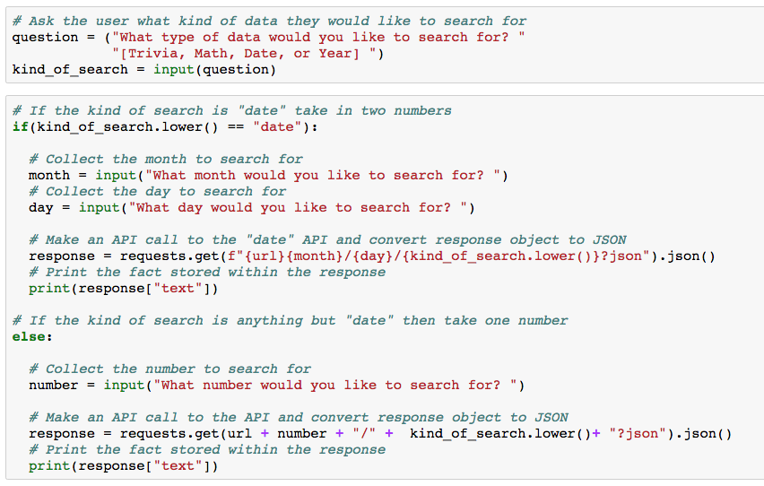

### 10. BREAK (0:15)

### 11. Instructor Do: OMDb API (0:10)

* Explain that, after having spent some time working with simple JSON objects, students are now ready to tackle handling JSON responses from more complex APIs.

  * Explain that the next couple of exercises will make use of the [OMDb API](https://www.omdbapi.com/) and slack out the link.

* Open the [06-Ins_OMDbRequests/Ins_OMDbRequests.ipynb](Activities/06-Ins_OMDbRequests/Solved/Ins_OMDbRequests.ipynb) demo in Jupyter Notebook.

  * Point out that this looks nearly identical to the API calls students have been working with. The URL for the API is stored before an API call is made. The response is then stored and converted to JSON. The keys are then printed via dictionary access.

  * Point out that the URL for the OMDb API is _slightly_ different from that students have used thus far. In particular, point out that the base URL ends with `?t=`.

  * Explain that the section of the URL following such a question mark is called a **query string**.

  * Query strings are a way of sending information from the client to the server, which the server can then interpret to return more specific data.

  * Explain that the `t` within the URL string stands for "title". This means that the URL `http://www.omdbapi.com/?t=Aliens` is asking the omdb API to return all of the information on movies with the title "Aliens."

  * The query string also includes something known as an "API Key" at the end. API keys are used by developers to collect data from APIs with some layers of protection on them. Without a valid API key for the omdb API, for example, no data would be returned.

    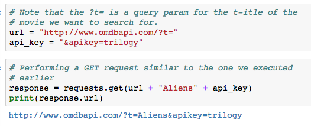

* Point out that, other than the query string, there is nothing new here—students are now capable of interacting with complex real-world APIs!

  

### 12. Students Do: Study the OMDb API (0:05)

* For this first part of the OMDB activity, students will be spending some time reviewing the documentation for the OMDB API and testing it out.

* **Instructions:**

  * Read the OMDb documentation, and make a few API calls to get some information about your favorite movie.

  * You are free to duplicate the demonstration from earlier or explore more freely as you wish. Just be sure to print two or three properties of the JSON you retrieve.

### 13. Students Do: Movie Questions (0:20)

* The class will now test their skills with the OMDB API as they attempt to collect some data from the API in order to answer a series of questions.

* Explain to students that they will be using the OMDb API to answer some specific questions about movies and slack out the instructions below.  You may also want to show them the following image to give them an expectation of how their output should look.

  

* **File:**

  * [08-Stu_MovieQuestions/Stu_MovieQuestions.ipynb](Activities/08-Stu_MovieQuestions/Unsolved/Stu_MovieQuestions.ipynb)

* **Instructions:** [08-Stu_MovieQuestions/README.md](Activities/08-Stu_MovieQuestions/README.md)

  * Use the OMDb API to retrieve and print the following information.

  * Who was the director of the movie **Aliens**?

  * What was the movie **Gladiator** rated?

  * What year was **50 First Dates** released?

  * Who wrote **Moana**?

  * What was the plot of the movie **Sing**?

### 14. Instructor Do: Movie Questions (0:05)

* Open up [08-Stu_MovieQuestions/Stu_MovieQuestions.ipynb](Activities/08-Stu_MovieQuestions/Solved/Stu_MovieQuestions.ipynb) in Jupyter Notebook and run through the code with the class line-by-line, making certain to hit upon the following points.

  * Point out that this activity did _not_ require the use of query string parameters other than `t`.

  * Point out that each response contains a full swath of information for each movie by default. This activity could be solved by simply dumping the JSON and identifying the right key to retrieve.

    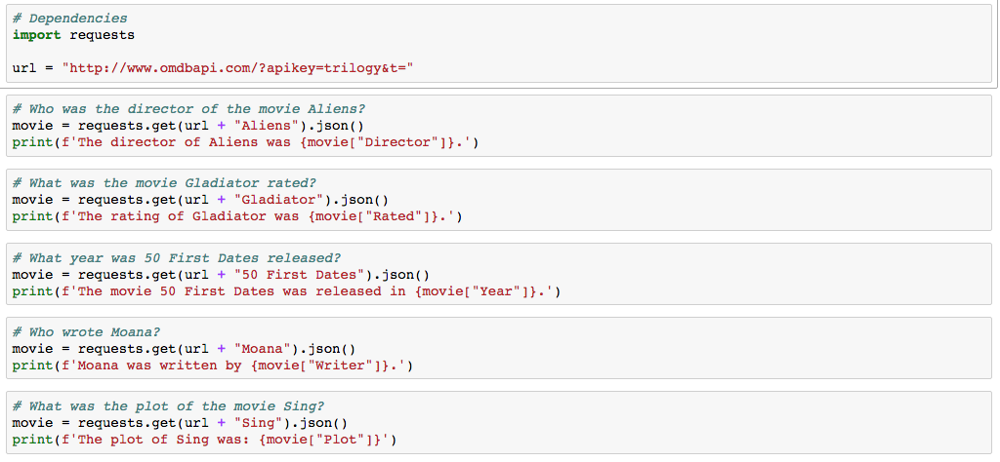

### 15. Instructor Do: Iterative Requests (0:05)

* Point out that the APIs the class has worked with so far have provided all the information needed from single requests.

* Explain that, sometimes, APIs will only respond with _some_ of the information needed on each request made.

  * It's common, for instance, for APIs to send a limited amount of data in response to each call.

  * The New York Times API for retrieving articles, for instance, only returns 10 at a time. In this case, if a programmer wanted to retrieve 30 articles, they would have to make 3 API calls.

* Explain that API calls can be made _iteratively_ by sending GET requests out from within a loop.

* Point out that an application may want to retrieve a small subset of articles with non-sequential IDs. For example, a user might want to see the posts whose IDs are 3; 89; and 74.

  * It would be wasteful to retrieve all 100 records, take the three that are desired, and throw away the rest. Rather, the application should request _only the articles needed_ and nothing more.

  * Explain that this can be done by storing the IDs desired within a list and then making an API call inside a loop for each ID inside of the list.

* Open [09-Ins_IterativeRequests/Ins_IterativeRequests.ipynb](Activities/09-Ins_IterativeRequests/Solved/Ins_IterativeRequests.ipynb).

  * Explain that the line containing `random.sample` simply generates a list of random IDs between 1 and 100 to request from the API.

  * Reassure students that they don't need to focus on this line just yet. This code is for generating data but is not related to iterative API requests per se.

  * Explain that the for loop makes a request to the API for each ID in the list and stores the response in `response_json`.

    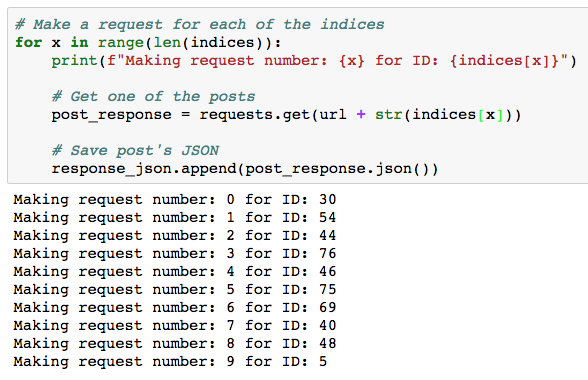

* Run the sample code a couple of times and draw attention to the command-line output. Point out that the IDs are indeed random on each execution of the script.

### 16. Students Do: Iterative Requests (0:10)

* The class will now test their knowledge of iterative requests by looping through a list of movies and collecting data from the OMDB API on them.

* Explain to students that the next activity requires them to loop through a given list and return information about that list.  Slack out the instructions below.  You may also want to show them the image below to help them visualize the expected output.

  

* **File:**

  * [10-Stu_MovieLoop/Stu_MovieLoop.ipynb](Activities/10-Stu_MovieLoop/Unsolved/Stu_MovieLoop.ipynb)

**\*Instructions:** [10-Stu_MovieLoop/README.md](Activities/10-Stu_MovieLoop/README.md)

* Consider the following list of movie titles.

  ```python
  movies = ["Aliens", "Sing", "Moana"]
  ```

* Make a request to the OMDb API for each movie in the list. Then:

  1. Print the director of each movie

  2. Save the responses in another list

### 17. Instructor Do: Review Activity (0:05)

* Open up [10-Stu_MovieLoop/Stu_MovieLoop.ipynb](Activities/10-Stu_MovieLoop/Solved/Stu_MovieLoop.ipynb) in Jupyter Notebook and run each cell after having students explain the code.

  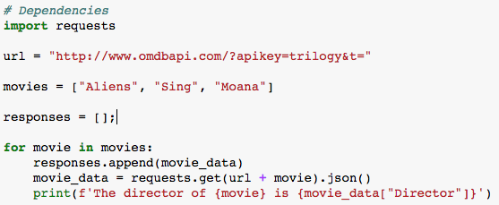

### 18. Instructor Do: NYT API (0:05)

* Explain that the final activity for the day will be an exercise in exploring yet another, fully-featured, "real-world" API; the New York Times article API.

* This API, unlike those which students have used up until this point in time, requires its user to register for an API key.

  * Walk through the process of acquiring an API key with the class.

  * It is as simple as filling out the form located on [this webpage](https://developer.nytimes.com/signup).

    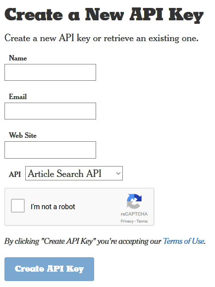

* Slack out the [documentation](http://developer.nytimes.com/article_search_v2.json#/Documentation/GET/articlesearch.json) for the NYT API and go through in brief detail with the class.

    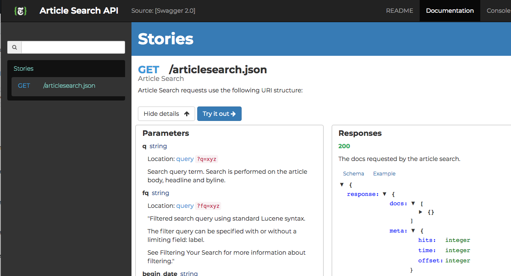

  * Try not to delve too deeply into the documentation, however, as part of the next activity should have students reading through it in order to uncover the query strings they need to create.

* Open the [11-Ins_NYTAPI/Ins_NYT_API.ipynb](Activities/11-Ins_NYTAPI/Solved/Ins_NYT_API.ipynb) demo within an IDE and then run the application while explaining each part of the code.

  * Highlight the use of the `config.py` file to store the `api_key`, and discuss that it is good practice to not upload API keys to GitHub.  While this API key is free, some services charge past a certain usage point.  Therefore, students should protect them from public view.  Discuss with students that they should add `config.py` to their `.gitignore` file or create environment variables for all homework and projects they will be saving to a repo.

  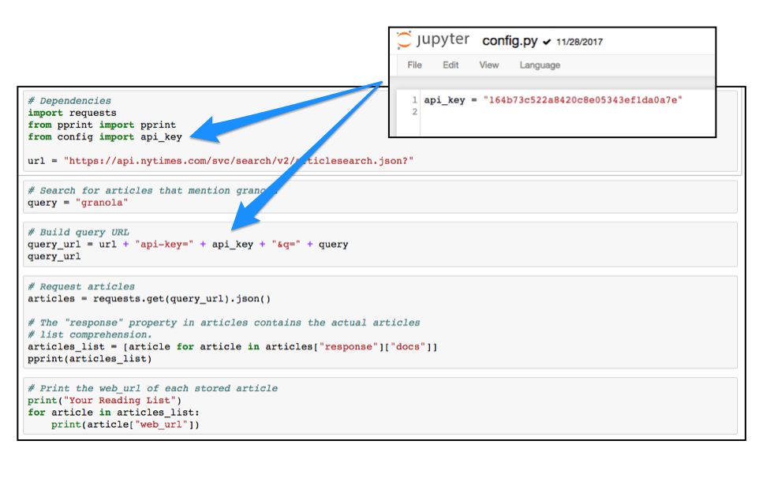

### 19. Students Do: Retrieving Articles (0:15)

* Students will now create an application that grabs articles from the NYT API, stores them within a list, and prints snippets of the articles to the screen.

* Open up [12-Stu_RetrieveArticles/Stu_Retrieve_Articles.ipynb](Activities/12-Stu_RetrieveArticles/Solved/Stu_Retrieve_Articles.ipynb) within the console and run the application, showing students what they will be attempting to create.

  

* **File:**

  * [12-Stu_RetrieveArticles/Stu_Retrieve_Articles.ipynb](Activities/12-Stu_RetrieveArticles/Unsolved/Stu_Retrieve_Articles.ipynb)

* **Instructions:** [12-Stu_RetrieveArticles/README.md](Activities/12-Stu_RetrieveArticles/README.md)

  * Save the NYT API endpoint to a variable. Make sure you include the right query parameter to retrieve JSON data!

  * Register for and save your API Key to a variable.

  * Decide on a search term, and save it to a variable.

  * Limit your search to articles published within a range of dates—for example, only articles published in 2014. _Hint_: Read the documentation on `end_date`.

  * Build your query URL, and save it to a variable.

  * Retrieve your list of articles with a GET request.

  * Take a look at the documentation. How do you get ahold of the articles in the response?

  * Store each article in the response inside of a list.

  * Print a `snippet` from each article.

  * As a bonus, try to figure out how we could get 30 results. _Hint_: Look up the `page` query parameter. If you get a message saying you've exceeded your rate limit, don't fret—you've solved the problem.

### 20. Instructor Do: Review Activity (0:05)

* Open up [12-Stu_RetrieveArticles/Stu_Retrieve_Articles.ipynb](Activities/12-Stu_RetrieveArticles/Solved/Stu_Retrieve_Articles.ipynb) in Jupyter Notebook and run through the code with the class line-by-line, making certain to hit upon the following points.

  * Ask different student to explain their solutions for each bullet point of the Instructions.

  * Focus on explaining the various query parameters used to build the query URL. These include:

  * `api-key`, the parameter that allows the code to query the server

  * `q`, for the keyword to **q**uery on

  * `begin_date` and `end_date`, both with format YYYYMMDD

* Point out that the remainder of the activity is similar to activities students completed before — the major difference is that they had to dig through documentation to find the right keys to use for this one.

  ```python
  # Dependencies
  import requests
  from config import api_key

  url = "https://api.nytimes.com/svc/search/v2/articlesearch.json?"

  # Store a search term
  query = "obama"

  # Search for articles published between a begin and end date
  begin_date = "20160101"
  end_date = "20160130"

  query_url = f"{url}api-key={api_key}&q={query}&begin_date={begin_date}&end_date={end_date}"

  # Retrieve articles
  articles = requests.get(query_url).json()
  articles_list = [article for article in articles["response"]["docs"]]

  for article in article_list:
    print(f'A snippet from the article: {article["snippet"]}')
  ```

* Briefly explain the solution to the bonus.

  * Explain that each API call retrieves 10 articles by default. Each group of articles is called a _page_.

  * If we want more articles, we need to tell the API to respond with _different pages_.

  * To do this, we simply append a `page` parameter, which is equal to the number of the page we want to retrieve.

  * Point out that sending requests like this often exceeds the rate limit for free-tier users.

  * Explain that a **rate limit** is a way for an API to throttle the number of requests a given application can make, in order to prevent abuse or server overload.

  * **Note**: Warn students not to print the query URLs with their key included; this would jeopardize their key if pushed to a public repository.

    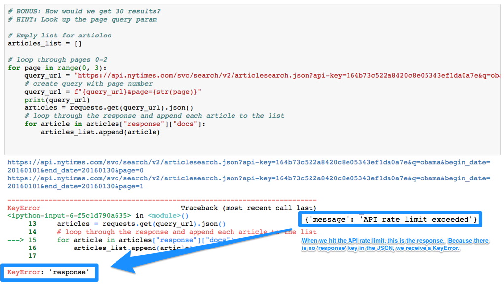

### 21. Instructor Do: Homework Solution and Close Class (0:05)

* Slack out the following video links for the Unit 4 Homework solutions:

  * [PyCity](https://youtu.be/qnS5M4-_RFs)

  * [Heroes of Pymoli](https://youtu.be/Jf6rqt5qjRM)

* Encourage students to review them on their own time and utilize office hours if they have additional questions.

- - -

### LessonPlan & Slideshow Instructor Feedback

* Please click the link which best represents your overall feeling regarding today's class. It will link you to a form which allows you to submit additional (optional) feedback.

* [:heart_eyes: Great](https://www.surveygizmo.com/s3/4381674/DataViz-Instructor-Feedback?section=6.1&lp_useful=great)

* [:grinning: Like](https://www.surveygizmo.com/s3/4381674/DataViz-Instructor-Feedback?section=6.1&lp_useful=like)

* [:neutral_face: Neutral](https://www.surveygizmo.com/s3/4381674/DataViz-Instructor-Feedback?section=6.1&lp_useful=neutral)

* [:confounded: Dislike](https://www.surveygizmo.com/s3/4381674/DataViz-Instructor-Feedback?section=6.1&lp_useful=dislike)

* [:triumph: Not Great](https://www.surveygizmo.com/s3/4381674/DataViz-Instructor-Feedback?section=6.1&lp_useful=not%great)

- - -

### Copyright

Trilogy Education Services © 2018. All Rights Reserved.
