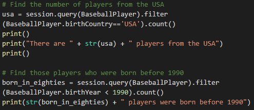
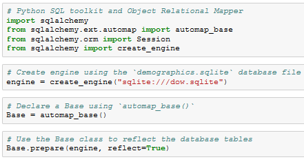
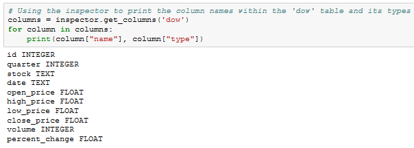

## 11.2 Lesson Plan - Advanced Usage of the SQLAlchemy ORM

### Overview

Today's lesson introduces students to some more of the nitty-gritty details of working with the SQLAlchemy ORM, including how to create complex queries, update rows, perform joins, and use ORM methods to perform queries.

#### Instructor Notes

* There are some MySQL databases being used during this lesson plan which may be challenging to connect to. If this happens, simply modify the activity to function with a database located on your local machine. **This means that you should 100% test the scripts in this lesson plan before using them!**

### Sample Class Video (Highly Recommended)

* To view an example class lecture visit (Note video may not reflect latest lesson plan):
  [Class Video 1](https://codingbootcamp.hosted.panopto.com/Panopto/Pages/Viewer.aspx?id=6fa4ab95-c06b-4cfd-987e-45b01c711a27)
  [Class Video 2](https://codingbootcamp.hosted.panopto.com/Panopto/Pages/Viewer.aspx?id=c9bfeaa7-d2ee-4271-aa73-5f302893d3b0)

- - -

### Class Objectives

* Students will be able to use the SQLAlchemy ORM to create classes that model tables.

* Students will be able to perform database CRUD operations using the SQLAlchemy ORM.

* Students will be able to reflect existing databases.

* Students will be able to use the SQLAlchemy Inspector to view table names in the database.

* Students will be able to plot the query results from the ORM.

- - -

### 1. Instructor Do: Welcome the Class (0:05)

* Welcome the class back to their second day of SQLAlchemy. Unlike the previous lesson, today will have a much greater focus on performing specific SQL tasks using SQLAlchemy's ORM capabilities. As such, if some students feel as if they are struggling to keep up, reassure them that they will be getting plenty of practice performing basic tasks with this library as well.

* Before moving into anything too complex or new, however, inform the class that they will be starting off the day with a short warm-up activity to refresh them on what they have already practiced.

### 2. Instructor Do: SQLAlchemy Queries (0:10)

* Crafting SQLAlchemy queries is actually quite a bit easier than one might first expect. To prove this point, open up [Ins_Basic_Querying.ipynb](Activities/01-Ins_Basic_Querying/Solved/Ins_Basic_Querying.ipynb) and go over the code with the class.

  * Make sure to mention to the class just how large the database is that is being used in this activity. It contains over 1000 rows of data which can be searched through.

  * To query a database for all of the records in a specific table, use `session.query()` and pass the SQLAlchemy class that is associated with the table through as a parameter.

    

  * To create a query that looks into a specific column and selects only that data that passes a logic test, use the `session.query(<SQL Class>).filter()` method. When using this method, pass the class and column to query using dot notation and follow this with the test to perform.

    

  * Want to query multiple columns using and/or? SQLAlchemy can accomplish this as well by using `or_()` or `and_()` within the filter method and passing multiple logic tests in as parameters.

    

* Answer whatever questions the class may have before moving onto the next activity.

### 3. Students Do: Shark Search (0:20)

* Students will now take some time to create a Python script that can search through the SQL file of shark attacks provided.

* **File**:

  * [sharks.sql](Activities/02-Stu_SharkSearch/Resources/sharks.sql)

* **Instructions**:

  * Create a new table within your database called "SharkSearch" and run the SQL code provided within SQLPro or MySQL Workbench

  * Within a Python script, create a "Sharks" class that will be able to read all of the columns in from the table you created

  * Using SQLAlchemy, perform the following queries...

  * Print all locations of shark attacks

  * Find the number of provoked attacks

  * Find the number of attacks in the USA

  * Find the number of attacks in 2017

  * Find the number of attacks while surfing

  * Find the number of fatal shark attacks in 2017 in Australia

### 4. Everyone Do: Shark Search Review (0:05)

* Open up the solution in [Activities/02-Stu_SharkSearch/Solved](Activities/02-Stu_SharkSearch/Solved/Stu_SharkSearch.ipynb), going through the code line-by-line and explaining the points below.

### 5. Instructor Do: Updating and Deleting Rows (0:10)

* So far students have learned how to both create and read data from a SQL database using SQLAlchemy. To continue their way through the CRUD acronym, however, they must now learn how to update data.

* Open up [03-Ins_Basic_Updating](Activities/03-Ins_Basic_Updating/Solved/Ins_Basic_Updating.ipynb) within an IDE and run through the code with the class, explaining the following.

  * Performing updates is actually as simple as creating a query for the row(s) to modify and then altering the returned object(s) in the desired way.

  * Make sure to point out that `.first()` is used as well. Without the use of this additional method, the changes will not be made.

  * Since the record already exists within the external database, there is no need to perform as `session.add()`. Developers instead only need to use `session.commit()` to update the rows in the table.

    

* Deleting rows is also very easy as it too is an extension of SQLAlchemy's querying functionality.

  * Perform a query to locate the row to delete and then add the `.delete()` method onto the end of the query statement.

  * Make sure to `session.commit()` for the delete to take effect.

    

* Answer whatever questions the class may have before moving onto the next activity.

### 6. Partners Do: What a Cruddy Database (0:20)

* In this activity, pairs of students will be tasked with creating a new SQLite database for a garbage collection company. They will need to create a table, add rows into the table, update some values in some rows, and finally delete a row from the database.

* **Instructions**:

  * Within a Python file, create new SQLAlchemy class called `Garbage` that holds the following values...

    * `__tablename__`: Should be "garbage_collection"

    * `id`: The primary key for the table that is an integer and automatically increments

    * `item`: A string that describes what kind of item was collected

    * `weight`: A double that explains how heavy the item is

    * `collector`: A string that lets users know which garbage man collected the item

  * Create a connection and a session before adding a few items into the SQLite database crafted.

  * Update the values within at least two of the rows added to the table.

  * Delete the row with the lowest weight from the table.

  * Print out all of the data within the database.

* **Bonus**:

  * Modify the application so that items can be added, updated, queried, or removed according to user inputs.

### 7. Everyone Do: What a Cruddy Database Review (0:05)

* Open up the solution in [Activities/04-CruddyDB/Solved](Activities/04-Par_CruddyDB/Solved/Par_CruddyDB.ipynb), going through the code line-by-line and explaining the points below.

- - -

### 8. BREAK (0:15)

- - -

### 9. Instructor Do: Reflections (0:10)

* Point out that, as data analysts, developers often need to analyze already existing data sources. This would mean having to create SQLAlchemy classes according to a table's columns by hand every single time.

* Thankfully SQLAlchemy provides tools for automatically creating ORM classes from an existing database.

  * Explain that these tools will load the data from an existing database and use that data to infer how to write ORM classes for use "automagically".

  * Explain that this process is called **reflection**.

* Open up [05-Ins_Reflection](Activities/05-Ins_Reflection/Solved/Ins_Reflection.ipynb) within Jupyter Notebook and explain that reflecting an existing database is a simple, four-step process:

  * First, import `automap_base` in from the SQLAlchemy library

  * Then, create an `engine` against the existing database that should be reflected

  * Next, create a `Base` by calling `Base = automap_base()`

  * Finally, call `Base.prepare` with the `engine` from Step 2 and `reflect=True` as its parameters

    

* Point out that `automap_base` is similar to `declarative_base` but creates a different `Base` class with additional features.

  * In particular, the class returned by `automap_base` has a `prepare` method, which will "automagically" reflect the data in an existing database.

* Explain that it is possible to view the automagically generated ORM classes by examining `Base.classes.keys()`.

  * Point out that, by default, these keys will share the name of the underlying database tables they represent.

  * Explain that it is possible to access these classes via dot notation: `<ExampleClassName> = Base.classes.<ExampleClassName>`

* Explain that, after the database has been reflected, the autogenerated ORM classes can be used just like developers would use custom classes.

  * Demonstrate that it is possible to interact with the database using these autogenerated classes in conjunction with a `session`, just as before.

    

* Take a moment to answer any remaining student questions before moving on.

### 10. Students Do: Reflecting on SQL (0:20)

* Students will now practice their ability to reflect existing databases using SQLAlchemy and a SQLite table focused upon demographic data.

  

* **File**:

  * [Activities/06-Stu_Reflecting/Resources/demographics.sqlite](Activities/06-Stu_ReflectingOnSQL/Resources/demographics.sqlite)

* **Instructions**:

  * Create engine using the `demographics.sqlite` database file

  * Declare a Base using `automap_base()` and use this new Base class to reflect the database's tables

  * Assign the demographics table/class to a variable called `Demographics`

  * Create a session and use this session to query the `Demographics` table and display the first five locations

* **Bonus**:

  * Query and print the number of unique locations in the table.

* **Hint**:

  * For the bonus, look into counting and grouping operations in SQLAlchemy

### 11. Everyone Do: Review Reflection on SQL (0:05)

* Open up the solution in [Activities/06-Stu_ReflectingOnSQL/Solved](Activities/06-Stu_ReflectingOnSQL/Solved/Stu_Reflection.ipynb), going through the code line-by-line and explaining the points below.

  * `Base` is instantiated with `automap_base` as opposed to `declarative_base`. `Base.prepare()` is then called, passing the SQL connection engine and the keyword argument `reflect=True` so as to create a reflection of the existing database.

  * A list of all of the reflected tables can be collected using `Base.classes.keys()`

  * The class associated with a given table can be collected by referencing the appropriate property within `Base.classes`

    

  * For the bonus, `group_by` allows one to "collapse" results that share a particular column value and then `count` can be used to count the number of rows returned by the query.

  * The query first creates a set for each demographic location that appears within the database and then counts the number of sets returned, thus yielding the number of unique locations represented in the database.

    

* Take a moment to answer any remaining student questions before moving onto the next activity.

### 12. Instructor Do: SQLAlchemy Exploration (0:05)

* Reflecting a database to collect the classes stored within is fine and good, but it does not provide its users with any real knowledge on as to what information is being stored.

  * In order to collect that kind of information, developers would want to look into the columns for a table and their associated datatypes.

* The creators of SQLAlchemy thankfully understood that this would be something users desired from the library and, as such, created an inspector tool.

  * The inspector tool allows SQLAlchemy developers to look through a connected database and explore its contents.

  * Unlike session queries, the inspector is primarily used to look up tables, columns, and datatypes. Looking up the specific values stored within a table is where queries should be used.

* Open up [087-Ins_Exploration](Activities/07-Ins_Exploration/Solved/Ins_Inspector.ipynb) within Jupyter Notebook and go over the code line-by-line.

  * The `inspect` module for SQLAlchemy can be imported into a script alongside the `create_engine` module.

  * To create an inspector, create a variable and set it equal to `inspect(engine)`. This variable can then be used to inspect elements within the connected database.

  * To get the names of tables stored within the connected database, use `inspector.get_table_names()`.

    

  * To collect the columns within a table inside of the connected database, use `inspector.get_columns(<Table Name>)` and pass the name of the table through as a parameter.

  * Simply loop through the columns collected and it is then possible to print out their names and type using `column["name"]` and `column["type"]`.

    

* Answer whatever question students may have before moving on to the next activity.

### 13. Students Do: Salary Exploration (0:15)

* Students will now take some time to create an inspector and search through a SQLite database was originally composed of over 1 million rows of data on US fires... But that did not fit on the GitHub repo so we replaced it with a database on salaries in San Francisco.

* **File**:

  * [database.sqlite](Activities/08-Stu_SalaryExplore/Resources/database.sqlite)

* **Instructions**:

  * Using the attached SQLite file, use an inspector to collect the following information...

  * The names of all of the tables within the database.

  * The column names and data types for the `Salaries` table.

  * Reflect the database, create a session, and query the `Salaries` table to collect the number of salaries that are over 50k per year.

### 14. Everyone Do: Fire Exploration Review (0:05)

* Open up the solution in [Activities/08-Stu_FireExplore/Solved](Activities/08-Stu_SalaryExplore/Solved/Stu_Salary_Explorer.ipynb), going through the code line-by-line and answering whatever questions students may have.

### 15. Groups Do: Emoji Plotting (0:25)

* For this activity, students will join forces to create a plot based upon the data stored within a SQLite database. Using the knowledge they have accrued thus far and SQLAlchemy's documentation, they should be able to accomplish this task.

* **File**:

  * [emoji.sqlite](Activities/09-Par_EmojiPlotting/Resources/emoji.sqlite)

* **Instructions**:

  * Use the inspector to explore the database and print out the table names stored within it.

  * Using the inspector, print out the column names and types for each of the tables contained within the SQLite file.

  * Reflect the database into a SQLAlchemy class and start a session that can be used to query the database.

  * Using Matplotlib, create a horizontal bar chart and plot the emoji score in descending order. Use `emoji_char` as the y-axis labels and plot only the top 10 emojis ranked by score

  * Create the same kind of chart using Pandas to plot the data instead of Matplotlib.

### 16. Everyone Do: Emoji Plotting Review (0:05)

* Open up the solution in [Activities/09-Stu_FireExplore/Solved](Activities/09-Par_EmojiPlotting/Solved/Stu_Plotting.ipynb), going through the code line-by-line and answering whatever questions students may have.

- - -

### LessonPlan & Slideshow Instructor Feedback

* Please click the link which best represents your overall feeling regarding today's class. It will link you to a form which allows you to submit additional (optional) feedback.

* [:heart_eyes: Great](https://www.surveygizmo.com/s3/4381674/DataViz-Instructor-Feedback?section=11.2&lp_useful=great)

* [:grinning: Like](https://www.surveygizmo.com/s3/4381674/DataViz-Instructor-Feedback?section=11.2&lp_useful=like)

* [:neutral_face: Neutral](https://www.surveygizmo.com/s3/4381674/DataViz-Instructor-Feedback?section=11.2&lp_useful=neutral)

* [:confounded: Dislike](https://www.surveygizmo.com/s3/4381674/DataViz-Instructor-Feedback?section=11.2&lp_useful=dislike)

* [:triumph: Not Great](https://www.surveygizmo.com/s3/4381674/DataViz-Instructor-Feedback?section=11.2&lp_useful=not%great)

- - -

### Copyright

Trilogy Education Services © 2018. All Rights Reserved.
