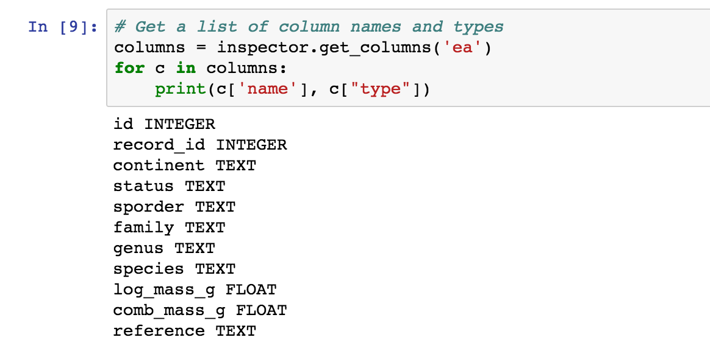
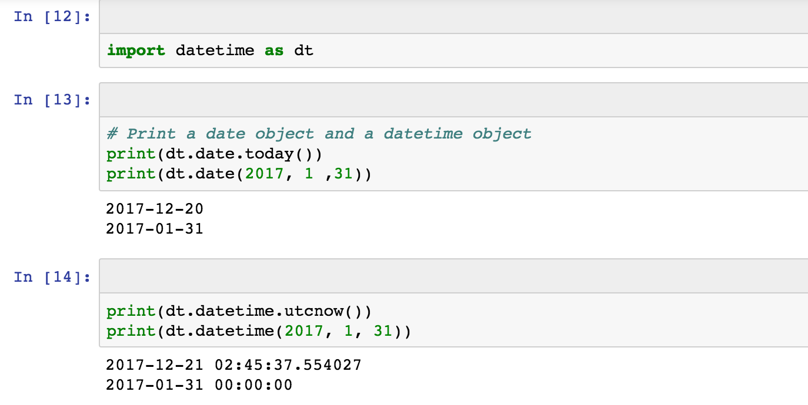
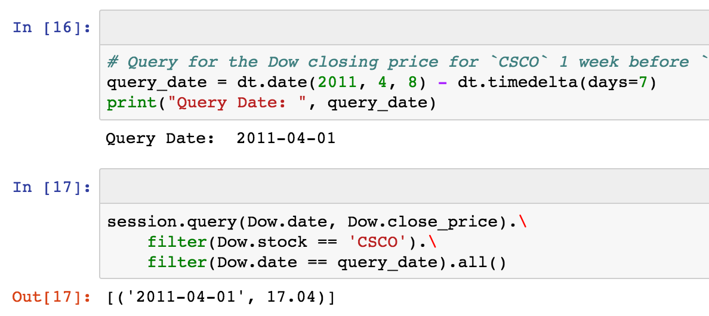
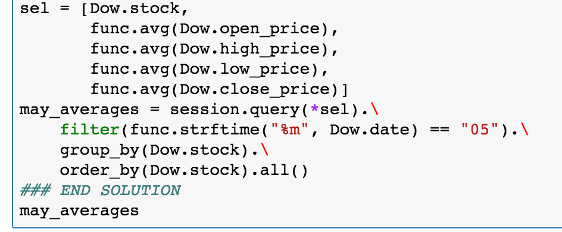
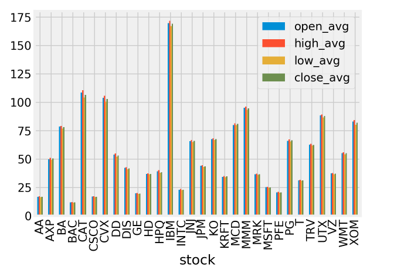
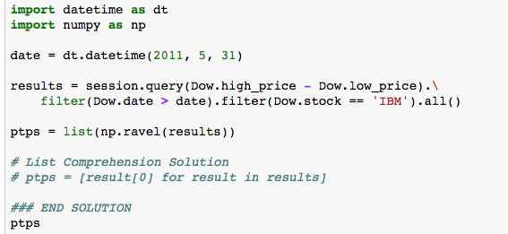
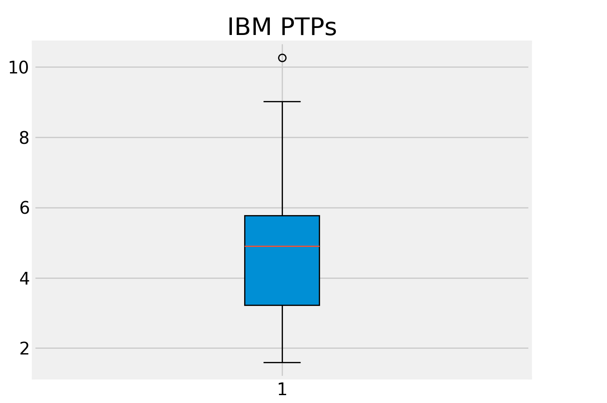

## 11.3 Lesson Plan - Introduction to Flask & Serving Data with APIs

### Overview

Today's lesson introduces students to the fundamentals of the web and client-server architecture;  how to use Flask to create a database-backed server; and how to use the same to design and implement API endpoints.

### Instructors Notes

* Have your TAs refer to the [TimeTracker](TimeTracker.xlsx) to stay on track.

### Sample Class Video (Highly Recommended)

* To view an example class lecture visit (Note video may not reflect latest lesson plan): [Class Video](https://codingbootcamp.hosted.panopto.com/Panopto/Pages/Viewer.aspx?id=d95278b4-f6cb-48e0-a4de-e69d8f8ee880)

### Class Objectives

* Students will be able to use Flask to create and run a server
* Students will define endpoints using Flask's @app.route decorator
* Students will learn to extract query variable path values from GET requests
* Students will use variable paths to execute database queries on behalf of the client
* Student will learn to return JSONified query results from API endpoints

- - -

### 01. Instructor Do: Joins (0:10)

* In this activity, you will demonstrate how to perform joins in SQLAlchemy.

* Open [01-Ins_Joins/Solved/Ins_Joins.ipynb](Activities/01-Ins_Joins/Solved/Ins_Joins.ipynb) and first review using a filter in SQLAlchemy, which is the equivalent of a SQL `WHERE` statement:

  

  * The `NA` (North American mammal) table is queried, and filtered for rows where the `genus` is `Antilocapra`.

* Moving on to joins, we first use `inspect` to retrieve the names of the tables in the database:

  

* Likewise, we can `inspect` to retrieve the names of the columns in a table:

  

* The following query selects for all `sporder` columns from both `EA` (Europe) and `NA` (North America) tables:

  

  * Explain that this performs a cross join, or combines each row in one table with all the rows of the other.

  * The basic join is a filtering of this result, which we will see in the next cell.

* The next statement joins the two tables together:

  

  * The `sel` variable is assigned to a list that holds the columns queried from both tables.

  * Then the results are filtered for rows in each the `sporder` is the same in both tables.

* Finally, the results are packed into a tuple and printed.

  

### 02. Instructor Do: Dates (0:10)

* This activity will be a demonstration of working with dates in SQLAlchemy.

* Dates have traditionally been trickier to manipulate than integers or decimals in programming.

  * For example, to add and subtract dates might involve doing so in seconds, then converting the results to days, months, weeks, or years.

  * Python offers libraries that make handling dates easier.

* The database used in this activity deals with stock prices across the Dow Jones index over a period of time.

* After setting up and reflecting the SQL database into Python objects with SQLAlchemy, show how to query the first date in the table:

  

  * To show the latest date, order the dates in descending order and query the first result.

* Explain that it is also possible to filter for dates greater than (or less than) a given date:

  

* Next, go over the Python `datetime` library.

  

  * `date.date` or `date.datetime` can be used to retrieve and format dates and datetimes in ISO format.

* Difference in time can also be calculated with `timedelta`:

  

* Demonstrate that it's possible to query a date using the `datetime` library, then use the results in a SQLAlchemy filter:

  

* Finally, demonstrate extracting a specific parameter, such as date, week, or hour, from a datetime object:

  

  * Here, only the date (20th) is parsed out.

* Optionally, show the final example, which demonstrates SQLAlchemy's `func.strftime` method:

  

### 03. Students Do: Dates (0:15)

* In this activity, students will practice working with dates, both in SQLAlchemy and with the `datetime` library. The instructions are included in the notebook file as comments.

* **File**: [03-Stu_Dates/Unsolved/Stu_Dates.ipynb](Activities/03-Stu_Dates/Unsolved/Stu_Dates.ipynb)

### 04. Instructor Do: Review Activity (0:05)

* The first task was to obtain the average price of each stock during the month of May.

* SQLAlchemy's `func.avg` method is used to obtain the average prices of opening, high, low, and closing prices.

  

  * These averages are queried, then filtered for results from the month of May.
  * `func.strftime` is used to filter for results from May.
  * `%m` specifies the month.

* May average prices are pulled into a pandas data frame, then plotted with Matplotlib:

  

  

* In the bonus, students were asked to subtract, from IBM's high price after May, 2011, its low price. They were also asked to use the `datetime` library.

  

  * The `datetime` library is used to assign a date to a variable.
  * It is then plugged into the SQLAlchemy query to filter out dates that come after May 31, 2011.

* Next, the boxplot:

  

  

### 05. Instructor Do: Introduction to Flask (0:15)

* Remind students that the Internet is built on model of _clients_ requesting data from _servers_.

* Remind students that whoever asks for information is called a "client".

* Point out that, when a person uses an API to fetch data, we have a tendency to consider the _person_ the client.

  * Point out that, _strictly speaking_, this isn't accurate: A _program_ makes a request on behalf of the person.

  * Point out that a **browser** is an example of a program that makes requests on behalf of a user.

* Point out that the same holds true for servers: A _server_ is simply a process running on a remote machine, that listens for, and knows how to respond to, incoming requests.

  * The point to emphasize is that a server is, essentially, _just a program_.

* Explain that, when we create an API for others to use, the code they write acts as a _client_ to our API server.

  * Point out that we have no control over the code our consumers write.

  * Point out that this means that, as API developers, **we do not write client code**.

* Emphasize that this means we will focus on writing the code that runs the server.

  * Remind students that this is the code responsible for retrieving and returning whatever data that users requests.

* Explain that [Flask](http://flask.pocoo.org/) is the tool that we'll use to implement our server.

  * Explain that Flask is an extremely intuitive library that makes it easy to develop APIs for distributing our data.

* Remind students that servers are programs that _listen_ for _requests_ to particular _URLS_, or **endpoints**.

  * Explain that Flask makes creating and starting a server trivial, and defining endpoints, easy: It takes less than 10 lines of code to define a functional index route!

* Open up [01-Ins_First_Steps_with_Flask/Solved/app.py](Activities/04-Ins_First_Steps_with_Flask/Solved/app.py), and explain the following.

  ```python
  # 1. import Flask
  from flask import Flask

  # 2. Create an app, being sure to pass __name__
  app = Flask(__name__)

  # 3. Define what to do when a user hits the index route
  @app.route("/")
  def home():
      print("Server received request for 'Home' page...")
      return "Welcome to my 'Home' page!"

  # 4. Define what to do when a user hits the /about route
  @app.route("/about")
  def about():
      print("Server received request for 'About' page...")
      return "Welcome to my 'About' page!"

  if __name__ == "__main__":
    app.run(debug=True)
  ```

* Explain that, to create a server, we simply import `Flask` (`#1`), and use it as a factory to create an `app` (`#2`).

  * Explain that, for our purposes, passing `__name__` to `Flask` is essentially mandatory.

  * [This is an important detail](http://flask.pocoo.org/docs/0.12/quickstart/#a-minimal-application), but it's outside the scope of today's lesson: Try not to get sidetracked if students inquire about this line.

* Explain how we use `@app.route` to associate an endpoint/URL (`/`, or `/about`) with the result of a function call (of `home` or `about`, respectively).

* Take a moment to hit each route in the browser, again.

  * Point out that, in the _terminal_, we see the results of the `print` message, _but not trace of the string we `return` to the client_.

  * Point out that, in the browser, we see the string the request handler _returns_, _but no trace of the call to `print`_.

  * Use this to illustrate and emphasize the relationship between the _client_—which receives a request handler's return value—and the _server_—where the functions associated with the response to a request are actually executed.

* Finally, remind students about using `if __name__ == "__main__"` to define "main" behavior.

  * Explain that `app.run` is all we need to do to _start_ the development server.

  * Explain that passing `debug=True` makes development _much_ easier, but emphasize that, in production, best practices demand that `debug` _must **always** be false_.

* Take a moment to address any questions before moving on.

### 06. Students Do: Hello, Web (0:10)

* **Files:** [Activities/05-Stu_Hello_Web/Unsolved/app.py](Activities/05-Stu_Hello_Web/Unsolved/app.py)

* **Instructions:** [Activities/05-Stu_Hello_Web/README.md](Activities/05-Stu_Hello_Web/README.md)

* Take a moment to run [Activities/05-Stu_Hello_Web/Solved/app.py](Activities/05-Stu_Hello_Web/Solved/app.py), and open it in the browser at [localhost:5000](http:127.0.0.1:5000). Demonstrate each of the below endpoints:

  * `/`

  * `/about`

  * `/contact`

* Point out that each of these endpoints simply returns a string.

* Take a moment to address any questions before allowing students to work.

### 07. Everyone Do: Review Activity (0:10)

* Remind students that the objective of this activity was to create a server with three static endpoints, each of which returns a simple string response.

* Open up [Activities/05-Stu_Hello_Web/Solved/app.py](Activities/05-Stu_Hello_Web/Solved/app.py), and point out each of the steps required to create a server and define endpoints with Flask.

```python
# 1. Import Flask
from flask import Flask

# 2. Create an app
app = Flask(__name__)

# 3. Define static routes
@app.route("/")
def index():
  return "Hello, world!"

@app.route("/about")
def about():
  name = "Peleke"
  location = "Tien Shan"

  return f"My name is {name}, and I live in {location}."

@app.route("/contact")
def contact():
  email = "peleke@example.com"

  return (
    f"Questions? Comments? Complaints?<br>"
    f"Send an email to {email}."
  )

# 4. Define main behavior
if __name__ == "__main__":
  app.run(debug=True)
```

* Explain that we:

  1. Import Flask

  2. Use Flask to create an `app`

  3. Use the `@app.route` **decorator** to define a route.

     * `@app.route` is a function which takes the route's URL as its argument.

     * We then define a function which describes how the server should respond to requests to the corresponding endpoint.

     * We can use whatever names we want for these functions, which are often called **request handlers**.

  4. Define the behavior for when we start the server by running the file from the command line with: `python app.py`. In this case, we run our flask app.

* Take a moment to answer any questions before moving on.

### 08. Instructor Do: JSON APIs with jsonify (0:10)

* All of the the routes we've written thus far have returned _string_ responses.

* The APIs we've dealt with do _not_ return raw text: rather, they return JSON data.

* Fortunately, Python dictionaries map naturally to JSON.

  * Flask has a built-in method to automatically convert a dictionary into a properly formatted JSON response: `jsonify`.

* Remind students that routes must return HTTP responses.

  * This means we can't simply return the dictionary itself.

  * We can use `jsonify` to create an HTTP response with the dictionary data we want to send back to the client.

* Open [Activities/06-Ins_Jsonify/Solved/app.py](Activities/06-Ins_Jsonify/Solved/app.py).

  ```python
  from flask import Flask, jsonify

  app = Flask(__name__)

  hello_dict = {"Hello": "World!"}

  @app.route("/normal")
  def normal():
      return hello_dict

  @app.route("/jsonified")
  def jsonified():
      return jsonify(hello_dict)

  if __name__ == "__main__":
      app.run(debug=True)
  ```

* Import `jsonify` in addition to Flask.

* The `/normal` route simply returns `hello_dict`, with no call to `jsonify`.

* We've used `return jsonify(<dictionary_name>)` to send a JSON response.

* Run `app.py`, and navigate to `localhost:5000/normal` to demonstrate the error Flask generates.

  * We've used `debug=True` to see detailed log output.

    

  * Explain that they should set `debug=False` in public-facing projects, otherwise they can easily leak data about their users and application accidentally.

* Navigate to `/jsonified`, and point out the working response.

  

* Take a moment to answer any questions before moving on.

### 09. Students Do: Justice League (0:20)

* **Files:** [Activities/07-Stu_Justice_League/Unsolved/app.py](Activities/07-Stu_Justice_League/Unsolved/app.py)

* **Instructions:** [Activities/07-Stu_Justice_League/README.md](Activities/07-Stu_Justice_League/README.md)

* Explain that students' task for this activity is to create a server configured to send welcome text at its index endpoint, and JSON data at its `api/v1.0/justice-league` endpoint.

* Run [Activities/07-Stu_Justice_League/Solved/app.py](Activities/07-Stu_Justice_League/Solved/app.py), and navigate to `localhost:5000/` in your browser to demonstrate the index route.

  

* Navigate to `localhost:5000/api/v1.0/justice-league` in your browser to demonstrate the API route.

  

* Answer any questions, and then give them time to work on it.

### 10. Everyone Do: Review Activity (0:10)

* Remind students that the goal for this assignment was to allow users to retrieve a list of JSON objects describing Justice League characters.

* Open up [Activities/07-Stu_Justice_League/Solved/app.py](Activities/07-Stu_Justice_League/Solved/app.py), and explain the following points.

* Point out that we've defined a list of character dictionaries, called `justice_league_members`, in the beginning of the file.

  * Explain that, to implement the `/api/v1.0/justice-league` route, we simply define a route that returns `jsonify(justice_league_members)`.

  ```python
  @app.route("/api/v1.0/justice-league")
  def justice_league():
      """Return the justice league data as json"""

      return jsonify(justice_league_members)
  ```

* Explain that the index routes simply sends a string response.

* We are using `jsonify` specifically because APIs should return JSON, _not_ strings. It turns our dictionary into a JSON response.

* Our endpoint starts with `/api` to indicate to consumers that the response will contain _data_.

* Explain that, by convention, `/api` routes should _always_ return data (JSON in this case).

* (Brief "pulse check"): Ask a student to explain why we must use `jsonify` in our `/api/v1.0/justice-league` route.

* Point out that we've defined a list called `justice_league_members`.

* Explain that this data will be stored in memory when we run our server.

* This list serves as a "database" of sorts—it does, after all, contain our application's data!

* Explain that "real" applications typically run against more data than can be loaded into memory. That is where a _database_ comes in.

* Ask the students if they have an idea of how you can hook this application up to a database.

* Explain that, if we simply replace the code where we define `justice_league_members` with code to connect to a SQLAlchemy database, we can turn this server into a truly _database-backed API_!

* Explain that we'll proceed in two steps:

  1. Use variable paths to collect "user input"

  2. Connect the application to a database.

* Take a moment to answer any questions before moving on.

- - -

### 11. BREAK (0:40)

- - -

### 12. Instructor Do: Routes with Variable Paths (0:10)

* Explain that our current API is only capable of returning the _entire_ Justice League data set.

* It would be better if users could specify a particular character of interest.

* Explain that, ideally, consumers would be able to specify a character of interest in the URL, and expect either:

  * A JSON response with the character data, if it's in the data set; or

  * A JSON response with error information, indicating that the server couldn't find the character the user requested.

* Run [Activities/08-Ins_Variable_Rule/Solved/app.py](Activities/08-Ins_Variable_Rule/Solved/app.py), and navigate to [localhost:5000](http:127.0.0.1/). The root path lists the available routes. Visit each route and contrast the results:

  * [/api/v1.0/justice-league](http:127.0.0.1:5000/api/v1.0/justice-league)

  * [/api/v1.0/justice-league/Arthur%20Curry](http://127.0.0.1:5000/api/v1.0/justice-league/Arthur%20Curry)

* The response at the second endpoint is _just_ the data for Aquaman, _without_ the rest of the data in `justice_league_members`.

* Explain that `%20` is how we represent the space character within a URL.

* Open [Activities/08-Ins_Variable_Rule/Solved/app.py](Activities/08-Ins_Variable_Rule/Solved/app.py), and point out that we've added a route.

```python
@app.route("/api/v1.0/justice-league/<real_name>")
def justice_league_character(real_name):
    """Fetch the Justice League character whose real_name matches
       the path variable supplied by the user, or a 404 if not."""

    canonicalized = real_name.replace(" ", "").lower()
    for character in justice_league_members:
        search_term = character["real_name"].replace(" ", "").lower()

        if search_term == canonicalized:
            return jsonify(character)

    return jsonify({"error": f"Character with real_name {real_name} not found."}), 404
```

### 13. Students Do: Routes with Variable Rules (0:20)

* **Files:** [Activities/09-Stu_Variable_Rule/Unsolved/app.py](Activities/09-Stu_Variable_Rule/Unsolved/app.py)

* **Instructions:** [Activities/09-Stu_Variable_Rule/README.md](Activities/09-Stu_Variable_Rule/README.md)

* Run [Activities/09-Stu_Variable_Rule/Solved/app.py](Activities/09-Stu_Variable_Rule/Solved/app.py), and demonstrate its `/api/v1.0/justice-league/superhero/<superhero>` endpoint by visiting [localhost:5000/api/v1.0/justice-league/superhero/superman](http://127.0.0.1:5000/api/v1.0/justice-league/superman) (**but try to keep the URL hidden**).

* Point out that this route is functionally identical to the `<real_name>` route from before, but allows users to specify the desired value of the character's `superhero` key instead.

* Take a moment to answer any questions before moving on.

### 14. Everyone Do: Review Activity (0:10)

* Open up [Activities/09-Stu_Variable_Rule/Solved/app.py](Activities/09-Stu_Variable_Rule/Solved/app.py).

* Remind students that the functionality for the new `<superhero>` route closely mirrors that of the `<real_name>` route from the instructor demonstration.

* Point out that the new route is identical to the `<real_name>` route; the only difference is that  we substitute `<real_name>` with `<superhero>`, and add `superhero` before defining the parameter to capture.

  * Explain that we must extend the URL or else the `<real_name>` and `<superhero>` routes will overlap.

* Explain that, as an alternative to defining the two _specific_ routes above, we could simply define a route that takes _two_ variable rules: `<key>` and `<value>`.

```python
@app.route("/api/v1.0/justice-league/<key>/<value>")
def justice_league_arbitrary_key(key, value):
    """Fetch the Justice League character whose <key> attribute has
       the value <value>."""

    for character in justice_league_members:
        if character[key] == value:
            return jsonify(character)

    return jsonify({"error": f"Character with key '{key}' with value '{value}' not found."}), 404
```

* Point out that this generalizes the pattern evident in the preceding endpoints by abstracting the hard-coded values `real_name` and `superhero` from the URL.

* Optionally, spend a few minutes discussing the advantages and disadvantages to each approach.

* Take a moment to answer any questions before moving on.

### 15. Instructor Do: Flask with ORM (0:15)

* Remind students that any useful API must make queries against data sets much too large to load into memory.

* Explain that we'll next see how to perform ORM queries within their Flask routes.

* Start by running the application and open the app in the browser [here](http:127.0.0.1:5000/). The root path will list the available routes. Visit each route and show the results.

  * [/api/v1.0/names](http:127.0.0.1:5000/api/v1.0/names)

  * [/api/v1.0/passengers](http://127.0.0.1:5000/api/v1.0/passengers)

* Next, open the file [Activities/10-Ins_Flask_with_ORM/Solved/app.py](Activities/10-Ins_Flask_with_ORM/Solved/app.py) and walk through the code.

* Explain that we start by initializing our database connection and reflecting our tables using `automap_base`.

* Show that our root route `/` simply shows the available API routes for our application.

* Move on to the route `/api/v1.0/names` and show how simple queries can be performed in the route function. This query will get executed each time that we visit the route.

* Explain that we use `list` and `np.ravel` to unpack the list of tuples into a regular list of names. Feel free to replace `jsonfiy(all_names)` with `jsonify(results)` to show what this looks like before converting to a list.

* Next, show the route `/api/v1.0/passengers` and explain that here we are extracting the results into a list of dictionaries containing the `name`, `age`, and `sex` of each passenger.

* Finally, explain that we can return the JSON representation for this list of dictionary data using jsonfiy.

* Ask students for any additional questions before moving on.

### 16. Students Do: Chinook Database Analysis (0:20) (Low)

* **Files**:

  * [Activities/11-Stu_Chinook/Unsolved/Stu_Chinook.ipynb](Activities/11-Stu_Chinook/Unsolved/Stu_Chinook.ipynb)

* **Instructions**: [readme](Activities/11-Stu_Chinook/README.md)

* This is the final activity for the Advanced Data Storage and Retrieval Unit. The goal of this activity is to give students additional practice in analysis of databases using the SQLAlchemy ORM. Encourage the students to take their time and ask plenty of questions as they go through this.

* Explain that the students will be analyzing invoice data from the [Chinook database](https://chinookdatabase.codeplex.com/wikipage?title=Chinook_Schema&referringTitle=Home).

* Explain to the students that they will design SQLAlchemy ORM queries to answer specific questions about the invoice data.

### 17. Everyone Do: Review Chinook Database Analysis (0:10)

* Open [Activities/11-Stu_Chinook/Solved/Stu_Chinook.ipynb](Activities/11-Stu_Chinook/Solved/Stu_Chinook.ipynb) and walk through the solution.

* Explain that the `import warnings` and `warnings.filterwarnings('ignore')` cell is simply to ignore the warning about using `Decimal` types with sqlite.

* Explain that we will continue to use `automap_base` to reflect our database tables.

* Show that we create an engine to the database file `chinook.sqlite`.

* Explain that our reflection results show that there are many tables available in the chinook dataset as can be seen in the [model diagram](https://chinookdatabase.codeplex.com/wikipage?title=Chinook_Schema&referringTitle=Home). However, we will only be using the `invoices` and `invoice_items` tables from this database.

* Show the students that we start by saving a reference to the `invoices` table as `Invoices`.

* We create a database session object to use for our ORM queries to the database.

* Explain that in the first solution, we simply group by the Billing Country and select `Invoices.BillingCountry` to get a list of the Billing Countries in the table. We can also achieve this result using the `distinct` function.

* The next query expands on the first by calculating the sum of invoice total per country. We also order the results by this value in descending order. Note that we have to use the sqlalchemy function `desc()` to sort in descending order.

* Explain that we will also save a reference to the `invoice_items` table as `Items`.

* Show that we can return the Billing Postal codes for the USA by filtering the BillingCountry and then grouping by postal code.

* In order to calculate the Item Totals for the USA, we will need to join the `Invoices` and `Items` table by `InvoiceId` to filter by billing country. Show the students the relationship between the two tables using the database model [here](https://chinookdatabase.codeplex.com/wikipage?title=Chinook_Schema&referringTitle=Home).

* The final query calculates the item totals per postal billing code. This query also requires an implicit join using `InvoiceId` and then filters by country. We group the results by billing postal code and then order by the item totals in descending order.

- - -

### LessonPlan & Slideshow Instructor Feedback

* Please click the link which best represents your overall feeling regarding today's class. It will link you to a form which allows you to submit additional (optional) feedback.

* [:heart_eyes: Great](https://www.surveygizmo.com/s3/4381674/DataViz-Instructor-Feedback?section=11.3&lp_useful=great)

* [:grinning: Like](https://www.surveygizmo.com/s3/4381674/DataViz-Instructor-Feedback?section=11.3&lp_useful=like)

* [:neutral_face: Neutral](https://www.surveygizmo.com/s3/4381674/DataViz-Instructor-Feedback?section=11.3&lp_useful=neutral)

* [:confounded: Dislike](https://www.surveygizmo.com/s3/4381674/DataViz-Instructor-Feedback?section=11.3&lp_useful=dislike)

* [:triumph: Not Great](https://www.surveygizmo.com/s3/4381674/DataViz-Instructor-Feedback?section=11.3&lp_useful=not%great)

- - -

### Copyright

Trilogy Education Services © 2018. All Rights Reserved.
