## 13.2 Lesson Plan - Kiss My Fist and Scrape the Sky

### Overview

Today's lesson dives into scraping websites with the Beautiful Soup library for Python. Students will start out scraping simple HTML strings before moving onto live web pages.

### Instructor Priorities

* Today's lesson relies upon scraping websites and, as such, students may find themselves blocked if a large portion of them choose to scrape the same website. If this happens, turn it into a learning opportunity and discuss how some sites keep track of requests to their sites and block IP addresses if hit too many times.

### Sample Class Video (Highly Recommended)

* To view an example class lecture visit (Note video may not reflect latest lesson plan): [Class Video](https://codingbootcamp.hosted.panopto.com/Panopto/Pages/Viewer.aspx?id=8f7299f4-741e-4228-9277-fec6c693775e)

- - -

### Class Objectives

* Students will be able to use Beautiful Soup to scrape their own data from the web.

* Students will learn to save the results of web scraping into MongoDB.

- - -

### 01. Instructor Do: Introduction to Beautiful Soup (0:10)

* Let the class know that today will serve as a brief introduction to Python's Beautiful Soup library, an extremely powerful - albeit strangely named - tool for web scraping.

  * Up to this point, the class has been force to rely upon analyzing web APIs and pre-existing data sets. From this day forth, however, students will know how to collect data from web resources that do not offer a full and convenient way to access to their data.

* Beautiful Soup has to be installed before Python can use it. To do this simply run `pip install bs4` within the terminal.

* Open up [01-Ins_SoupIntro](Activities/01-Ins_SoupIntro/Unsolved/IntroToSoup.ipynb) within Jupyter Notebook, going through the code within line-by-line with the class and answering whatever questions students may have.

  * The line `from bs4 import BeautifulSoup as bs` is used to import the Beautiful Soup library into the application.

  * In this example, Beautiful Soup will be working with some basic HTML that is stored as a string. Let the class know that this is being used instead of an external HTML file at the moment.

  * A Beautiful Soup object is parsed/created using `bs(html_string, 'html.parser')` and the object returned is assigned to the `soup` variable.

  * Remind students that the DOM is a tree whose structure is defined by the nesting of tags. Beautiful Soup looks through this tree and then converts it into a specialized object equipped with powerful methods for traversing and searching the HTML for attributes, text, etc.

  * The `type(soup)` method being used confirms that the `soup` object created is indeed a BeautifulSoup object.

  * The `prettify()` method of the Beautiful Soup library is then used to return a formatted version of the object that is easier to read.

    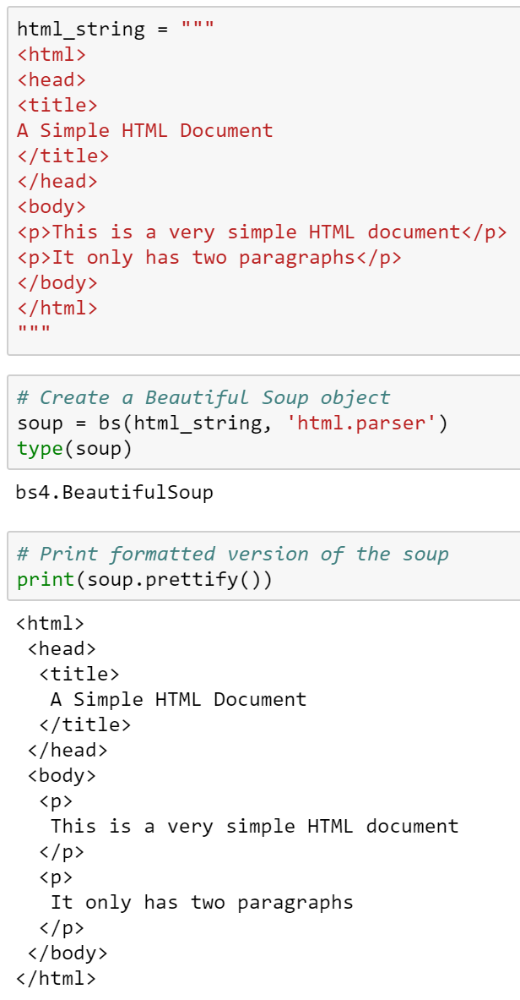

* Now demonstrate how different parts of the HTML can be extracted using dot notation.

  * Begin by extracting the title element of the HTML document using `soup.title`. This returns the entire HTML element, including the tags themselves.

  * If the developer only desires to collect the text contained within the title element and nothing else, they can simply add `.text` to the end of their call. This will return the string surrounded by whitespace.

  * The text can be further cleaned by adding `.strip()` onto the end of the chain. Now the text value will be on its own.

    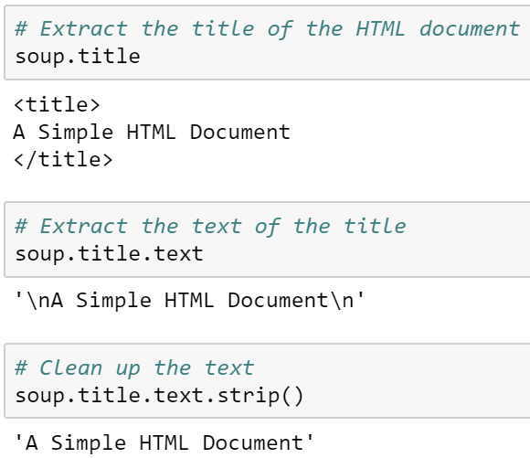

* Demonstrate to the class how the HTML's body can be collected, referenced, and printed to the screen.

  * Using `soup.body`, Python developers can print out the entire body of an HTML file with each element's tags included. Adding `.text` and `.strip()` to the end of the chain will further parse down the values returned.

  * Using the line `soup.body.p.text`, the text for only the first paragraph will be collected. Adding `.strip()` to the end of this chain will remove the whitespace as well.

    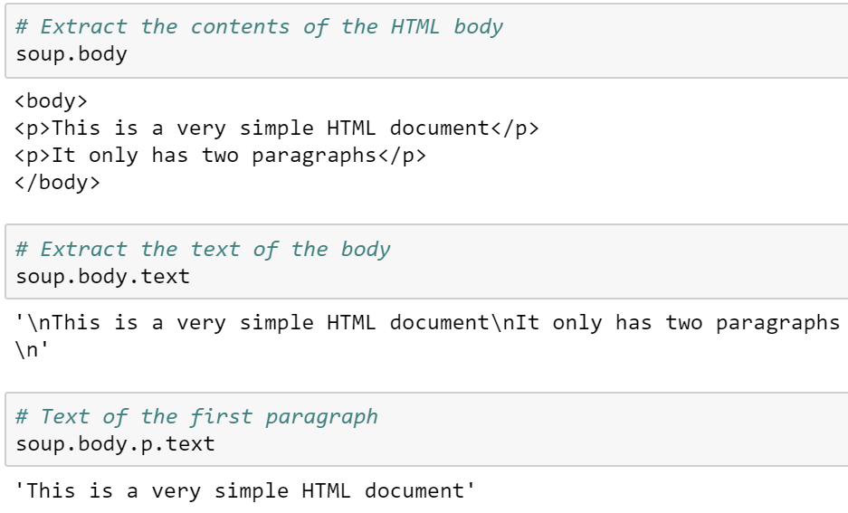

  * The `find_all(<ELEMENT>)` method returns a list containing all of the HTML elements of a specific type. As such, every paragraph (`<p>`) element on a page can be collected using `soup.body.find_all('p')`.

  * Index numbers can then be used to access the paragraph elements in a targeted fashion. Thus allowing developers to target more than the first instance of an element.

    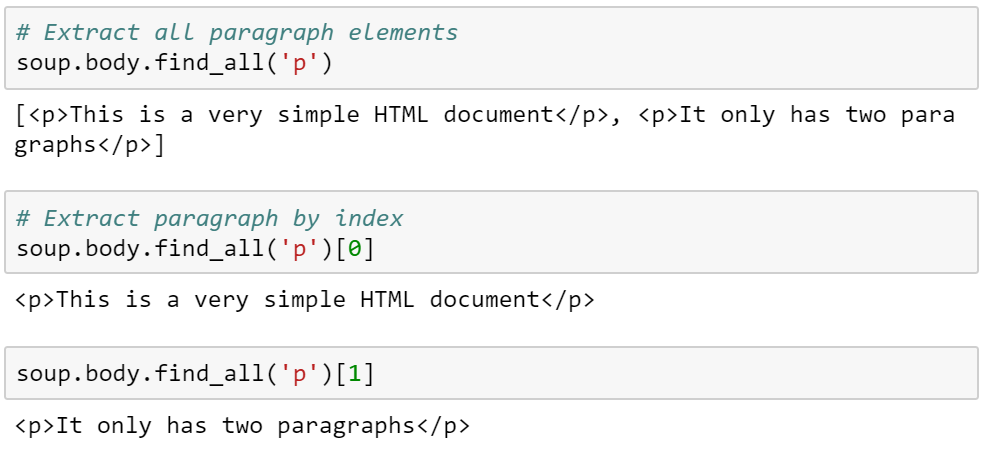

* Answer whatever questions students may have before moving onto the next activity.

### 02. Students Do: CNN Soup (0:15)

* In this activity, students will take their first steps in web scraping by taking an external HTML file, parsing it, and then printing out specific elements to the console.

  

* **Files**:

  * [Stu_CNN-Unsolved.ipynb](Activities/02-Stu_CNNSoup/Unsolved/Stu_CNN-Unsolved.ipynb)

* **Instructions**:

  * Believe it or not, CNN's website for [1996: Year in Review](http://edition.cnn.com/EVENTS/1996/year.in.review/) is still alive on the web! We have, however, stored the HTML document as a string in your starter file.

  * Your task, should you accept it (and you should), is to use Beautiful Soup to scrape and print the following pieces of information:

  1. The title of the webpage

  2. All paragraph texts on the page

  3. The top 10 headlines for the year. This last one is a bit tricky and may not come out perfectly!

* **Hint**:

  * For the third task in this activity you will need a means of filtering the data... Perhaps over multiple iterations... With a loop... HINT HINT!

* **Bonus**:

  * If you finish early, head over to the [Beautful Soup documentation](https://www.crummy.com/software/BeautifulSoup/bs4/doc/) to read up on accessing attributes and navigating the DOM.

### 03. Everyone Do: Review A Soup Starter(0:10)

* Open up [Stu_CNN.ipynb](Activities/02-Stu_CNNSoup/Solved/Stu_CNN.ipynb) within Jupyter Notebook and go through the code line-by-line with the class, answering whatever questions students may have and hitting upon the following points.

  * Finding the `title` of the document is very easy. Simply use `soup.title.text` and the HTML file's title element will have been collected.

  * To print all the paragraphs, `soup.find_all('p')` can be used and before looping over the results to print their text to the console.

    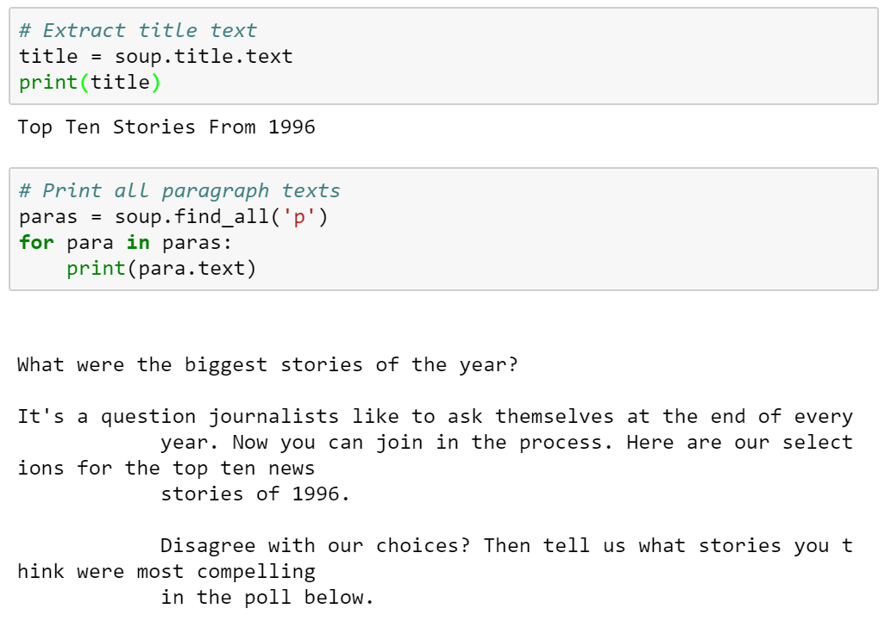

  * The final part is a bit trickier. Users should initially find all `td` elements in the HTML document and then, as they loop over them, select only cells that contain a child `anchor` element.

  * Note the use of short-circut logic to check if `td.a` and `td.a.text` exist. Only if the element passes these two tests will its contents be added into the headlines list.

  * Finally, only the first 10 items within the headlines list are printed since other headlines on the page made it through the last step as well.

    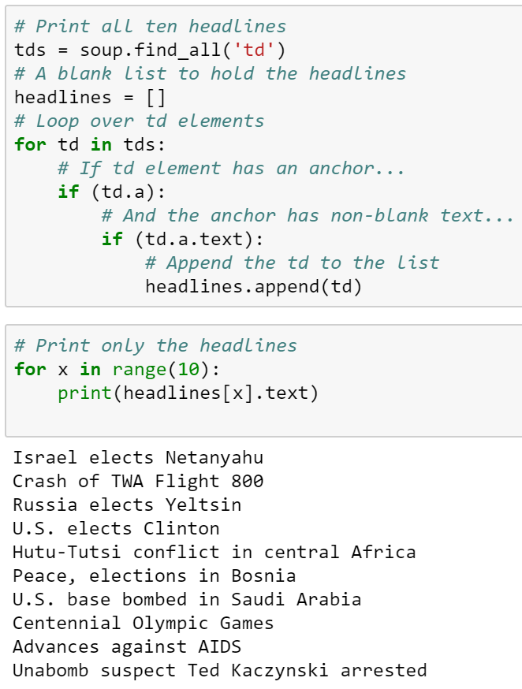

### 04. Instructor Do: Craig's Wishlist (0:05)

* So far the class has only parsed HTML strings with Beautiful Soup. Now it is time to scrape a live website!

* Explain that the first site to scrape will be `craigslist.com` to find the perfect gift for a friend.

  * The goal will be to scrape the results for an item - such as a guitar - on Craig's List and return each relevant listing's title, price, and link.

* Now open up [Ins_Craigslist.ipynb](Activities/03-Ins_Craigslist/Solved/Ins_Craigslist.ipynb) go through the code with the class, answering whatever questions students may have.

  * Explain how the `requests` module is used to obtain the HTML object. Beautiful Soup then parses the returned object and converts it for further use.

    

  * The Beautiful Soup object is then pretty-printed to the console for analysis. This allows the developer to search through the source code and find what elements they wish to grab.

  * Another method of examining the HTML is to navigate to the webpage itself and open up the page's source within the inspector.

  * Through analysis of the HTML code, one finds that data desired is being stored within the HTML as a list item whose class is "result-row". The tittle of the item also takes the form of an anchor element whose class is "result-title".

    

  * The listing price can also be found to exist within a `span` element whose class is `result-price`.

  * To actually retrieve the contents of these elements, a `find_all('li', class_='result-row')` method can be called on the `soup` object.

  * Print out all of the `results` and a Python list of all the Craigslist listings from the query will be printed to the console.

    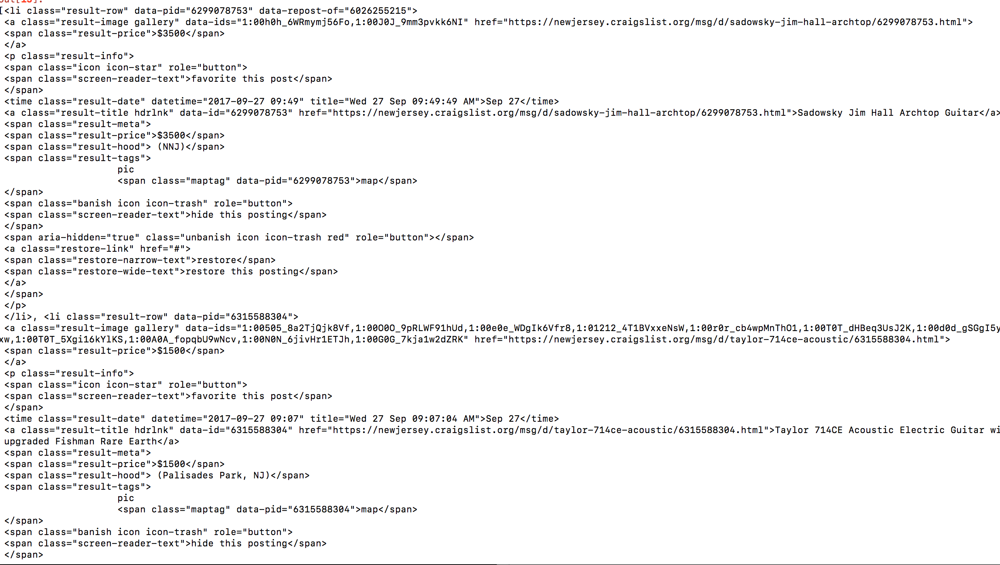

  * By iterating through the listings, specific information can then be pulled from the Beautiful Soup object.

  * Each listing's title can therefore be gathered using `result.find('a', class_='result-title")`, their prices collected with `result.a.span.text`, and their links retrieved by accessing the "href" attribute of each listing using `result.a["href"]`.

  * Point out that an element's attributes are accessed using the square bracket notation.

    

* Displaying the results collected is as simple as printing the data to console as they are collected.

* Answer whatever questions the class may have before moving onto the next activity.

### 05. Students Do: Reddit Scraper (0:20)

* In this activity, students will scrape the Python Reddit for potentially interesting content. They will also have to filter for threads with twenty or more comments in them.

  

* **Instructions**:

  * In this activity, you will scrape the [Python Reddit](https://www.reddit.com/r/Python/) using Beautiful Soup. Scrape only threads that have twenty or more comments and then print the thread's title, number of comments, as well as the URL for the thread.

### 06. Instructor Do: Review Reddit Scraper (0:10)

* There are many possible solutions to the activity. Explain that this is only one of them!

* Open up the [Python Reddit](https://www.reddit.com/r/Python/) in Chrome inspector: `view-source:https://www.reddit.com/r/Python/` and spend a minute or two parsing the information needed for this scraping activity.

* Explain that with Beautiful Soup's `find_all()` method, we retrieve all the entries on the page whose class is `top-matter`:

  ```python
  results = soup.find_all('div', class_='top-matter')
  ```

* We're then able to loop through the `results` to find each thread's title, number of comments, and the URL:

  ```python
  title = result.find('p', class_='title')
  title_text = title.a.text

  thread = result.find('li', class_='first')
  comments = thread.text

  link = thread.a['href']
  ```

* Explain that we also may also, optionally, elect to sort the results by the number of comments in the future. Accordingly, we need to parse the string containing the number of comments, e.g. "45 comments":

  ```python
  comments_num = int(comments.split()[0])
  ```

* First we split the string, then transform the number string into an integer.

* For the bonus, explain that we would have had to perform a second request with each thread's URL, using `requests`, made a second Beautiful Soup object, and retrieved the first comment.

* Answer any questions before moving on.

### 07. Instructor Do: Mongo Craig (0:10)

* Open up [Ins_MongoScraping.ipynb](Activities/05-Ins_MongoScraping/Solved/Ins_MongoScraping.ipynb) and explain to the class how they will now learn how to translate the results of a web scraper to a MongoDB database.

  * The application starts out by importing the relevant dependencies, initializing Pymongo, and defining the MongoDB database and collection.

  * Explain that, instead of `html.parser`, the `lxml` parser is being used. Slack out [this link](https://www.crummy.com/software/BeautifulSoup/bs4/doc/#installing-a-parser) to the class which provides an informative table on the various parsers available to Beautiful Soup and explain that some parsers are more flexible with parsing HTML than others.

  * Students may need to install the `lxml` module with `pip install lxml` from their console for this parser to function.

    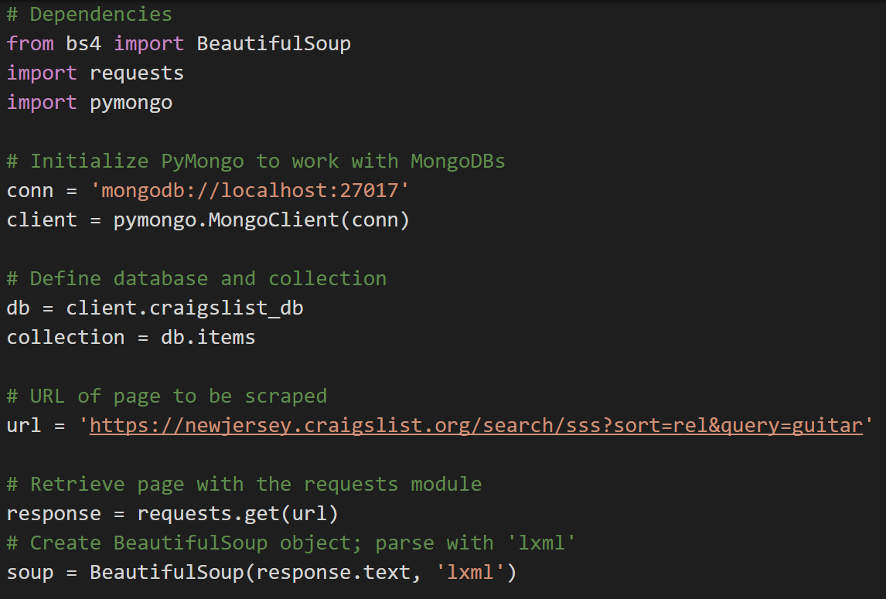

  * Much of the code is familiar to the earlier example from craigslist. Explain that as the application loops through the results of the `soup` object it is simply gathering the information into a dictionary and then posting it to the mongoDB database.

    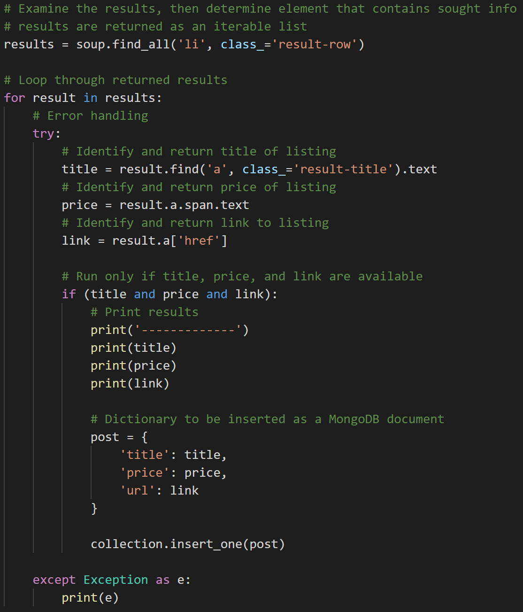

  * After the application has pushed all of the scraped data into the Mongo database, this can be verified by querying the database one and printing out all of the results to the console.

    

  * Alternatively, the user could also query the database from the console... If they really wanted to.

    

* Run through the code one more time with the class, having students explain the function of each code block to the best of their ability.

  * Answer whatever questions students may have before moving onto the next activity.

### 08. Students Do: Hockey Headers (0:15)

* In this activity, students will scrape the front page of the NHL website for articles and then post the title/header of each article to MongoDB.

  

* **Instructions**:

  * Teamwork! Speed! Mental and physical toughness! Passion! Excitement! Unpredictable matchups down to the wire! What could be better? While these terms could easily be applied to a data science hackathon, we're talking about the magnificent sport of hockey.

  * Your assignment is to scrape the articles on the front page of the [NHL website](https://www.nhl.com/) - which is frequently updated - and then post the results of your scraping to MongoDB.

  * Use Beautiful Soup and requests to scrape the title and heading of each article on the front page.

  * Post the above information as a MongoDB document and then print all of the documents on the database to the console.

  * In addition to the above, post the time and date of the article publication as well.

### 09. Instructor Do: Review Hockey Headers (0:05)

* **Files:** [Stu_Hockey.ipynb](Activities/06-Stu_HockeyHeaders/Solved/Stu_Hockey.ipynb)

* The main focus of this activity was for students to post scraped data into MongoDB. Do not spend excessive time on the minute details of the activity.

* During review, emphasize the broad strokes of the steps we took. We examined the inspector for HTML elements to scrape, extracted their text, then posted them to MongoDB.

* For the timestamp, it should suffice to explain simply that we find the string element then slice parts of it to re-compose it to fit our needs.

- - -

### 10. BREAK (0:15)

- - -

### 11. Instructor Do: Introduction to Splinter (0:15)

* **Important**: students must have the Chrome Webdriver installed for this activity Slack out the link to the documentation on installing the Chrome Webdriver: <https://splinter.readthedocs.io/en/latest/drivers/chrome.html>

* Up to this point, students have used Beautiful Soup to scrape a single, static page at a time.

  * Point out that, often, developers can only access interesting parts of a website after engaging in some kind of interaction with it.

  * Point out that, typically, these interactions are pretty easy to automate: Logging in, filling out and submitting forms, etc.

  * Explain that, when the data is "buried" behind such dynamic interactions, a web driver can be used to write scripts for the browser!

  * Explain that this allows developers to simulate user interactions programmatically and scrape multiple pages along the way.

* Mac users, if they have `brew` installed, can simply run `brew install chromedriver` from their terminal.

  * Windows users will need to [download the driver](https://sites.google.com/a/chromium.org/chromedriver/downloads), extract the executable program file, and then place it in the same folder as their Python script.

  * Have the TAs assist students who have trouble with installation.

* Open up [Ins_Splinter.ipynb](Activities/07-Ins_Splinter/Solved/Ins_Splinter.ipynb) and explain that Splinter is a Python module that automates browser actions such as visiting a URL, filling fields, and clicking buttons. It can be a very useful tool in the webscraper's arsenal!

  * Go to <http://quotes.toscrape.com/>, a sample page to practice web scraping. At the bottom is a `Next` button. Explain that the application we are using will use Splinter to click these buttons and scrape each page.

    

  * From the console, run the code, and show the results to the class.

    

  * Each quote on a page is displayed along with its page number! Awesome!

* Walk through the code contained within with the class, explaining the application line-by-line.

  * As per usual, the application starts by importing in all of the dependencies needed.

  * An instance of a Splinter browser is then created. The driver being used for the browser interaction is 'chrome', and `False` is passed for the `headless` option. This means that the browser's actions will be displayed in a Chrome window so that the process can be seen.

  * The specified URL is then accessed and visited.

    

  * Explain that for each page, developers will need to parse and display that site's contents, i.e. quotes. The browser then need to click the `Next` button to proceed onto the next page to collect the next collection of quotes.

  * Open the Chrome inspector to identify the element that the application will need to click.

    

  * Navigate to [Splinter's documentation](https://splinter.readthedocs.io/en/latest/elements-in-the-page.html) and inform the class that Splinter offers various ways of interacting with the page, including clicking an element by its text.

  * The next part is a for-loop with five iterations that uses Beautiful Soup to parse the page by collecting all of the quotes in that location.

  * Additionally, after printing all the quotes on a page, the application clicks on the `Next` button with Splinter's `click_link_by_partial_text()` method.

    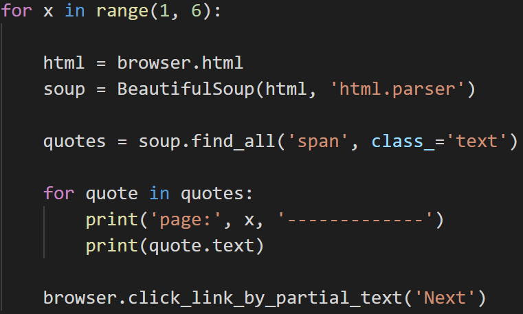

  * Finally, explain that there are ten total pages on this practice website, but that this application arbitrarily chose five as the number of pages to cycle through.

* Answer any questions that students may have. In the next activity, they will be able to practice dynamic webscraping.

### 12. Students Do: Bookscraper (0:15)

* **File:** [README.md](Activities/08-Stu_Splinter/README.md)

* In this activity, students will practice their webscraping skills on a site similar to the one shown in the instructor demonstration.

### 13. Instructor Do: Review Bookscraper (0:05)

* **File:** [Stu_Splinter.ipynb](Activities/08-Stu_Splinter/Unsolved/Stu_Splinter.ipynb)

* Here are some highlights to consider for the review.

* We iterate through each page and retrieve the HTML object, which we parse with Beautiful Soup. Using the browser inspector, we identify elements that contain information for each book, which we call `articles` in this case:

  ```python
  for x in range(50):
      html = browser.html
      soup = BeautifulSoup(html, 'html.parser')
      articles = soup.find_all('article', class_='product_pod')
  ```

* Inside the above loop, we simply navigate inside each `article`, first finding its first `h3` element, then the latter's first anchor, or `a` element. We then retrieve the attributes of the anchor element, including its `href` and `title`:

  ```python
  for article in articles:
      h3 = article.find('h3')
      link = h3.find('a')
      href = link['href']
      title = link['title']
      print('-----------')
      print(title)
      print('http://books.toscrape.com/'+ href)
  ```

* Answer any questions before moving on.

### 14. Instructor Do: Pandas Scraping (0:10)

* **Files**:

  * [Ins_Pandas_Scraping.ipynb](Activities/09-Ins_Pandas_Scraping/Solved/Ins_Pandas_Scraping.ipynb)

* Explain that Pandas actually has some built-in scraping capabilities.

* Visit the Wikipedia article [List of capitals in the United States](https://en.wikipedia.org/wiki/List_of_capitals_in_the_United_States) to show students the data table listed in the article.

* Explain we can use the `read_html` function in Pandas to try and parse tabular data from HTML.

* Scroll through the table data that `read_html` collects from  the wikipedia article.

  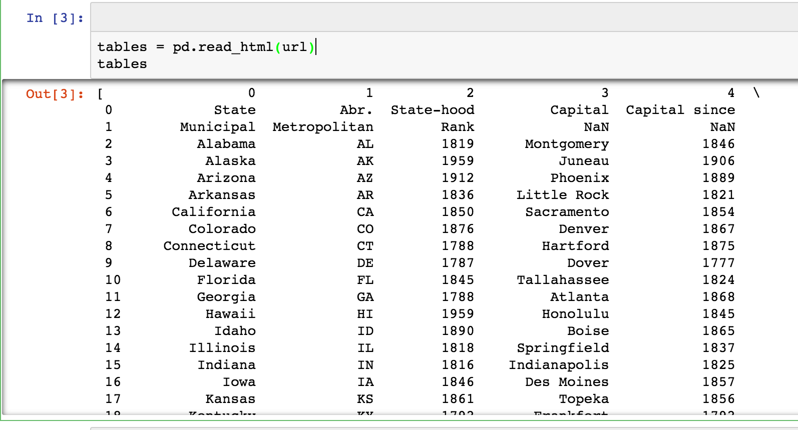

* Students may be surprised to see that multiple sections of data were returned from the list. This may be a good time to poll students for their theories on what the data is.

* Print the `type` of the _tables_ variable to show that the return value of `read_html` is a list.

  

* Explain that `read_html` actually tries to convert as much of the HTML into DataFrames as possible and therefore returns a list of DataFrames.

* Show that we can use list indexing to grab a reference to the DataFrame that we are interested about.

  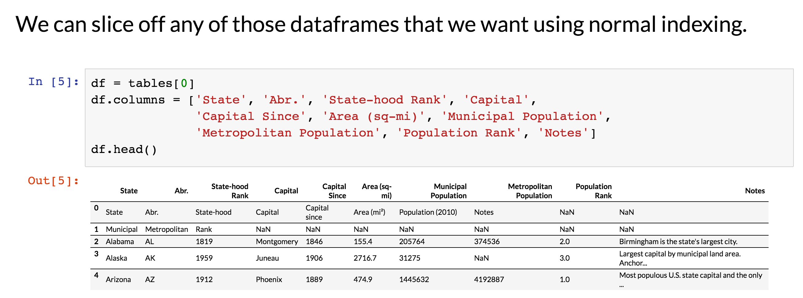

* Explain that we often have to do a lot of data cleaning on these scraped DataFrames. Quickly walk the students through examples of setting columns, deleting header rows, and setting the index to the `State` column.

  

  

* Show students the DataFrame data for one of the states using `loc`.

  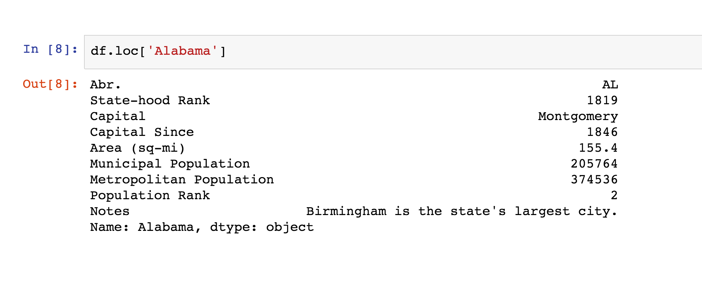

* Explain that we can also convert DataFrames back to HTML tables using the `to_html` function.

  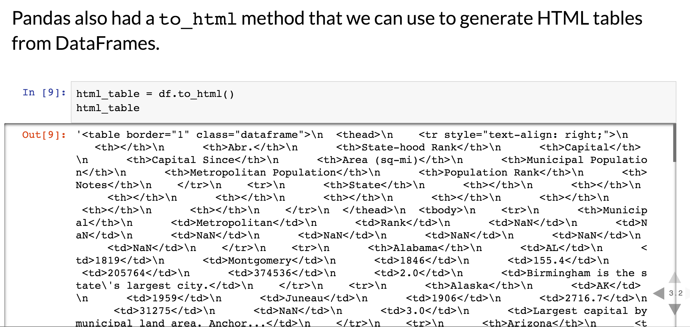

* Explain that we may need to use `replace` to remove extra newlines from the code.

  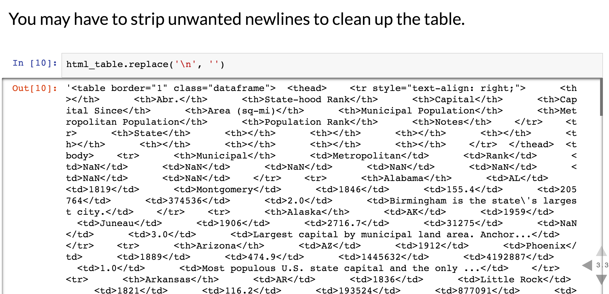

* Finally, explain that we can also save the HTML table to a file. After running `df.to_html('table.html')`, open the file in the browser to show students the table rendered as HTML in the browser.

  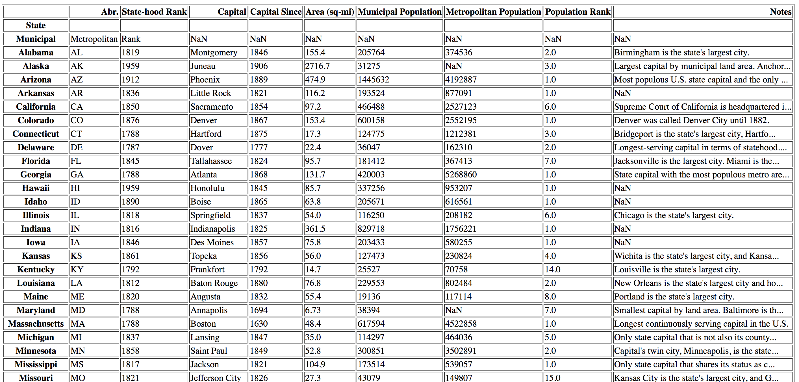

### 15. Students Do: Doctor Decoder (0:15)

* **Files**: [Stu_Doctor_Decoder.ipynb](Activities/10-Stu_Doctor_Decoder/Unsolved/Stu_Doctor_Decoder.ipynb)

* **Instructions**: [README](Activities/10-Stu_Doctor_Decoder/README.md)

* Inform students that they may need to install `html5lib` with the console command, `pip install html5lib`.

### 16. Everyone Do: Review Activity (0:05)

* Open [Stu_Doctor_Decoder.ipynb](Activities/10-Stu_Doctor_Decoder/Solved/Stu_Doctor_Decoder.ipynb) and walk through the solution. This activity is very similar to the previous Instructor activity except that the index of the DataFrame of interest as at index `2`.

  

* Ask the students if they have any questions before moving on.

- - -

### LessonPlan & Slideshow Instructor Feedback

* Please click the link which best represents your overall feeling regarding today's class. It will link you to a form which allows you to submit additional (optional) feedback.

* [:heart_eyes: Great](https://www.surveygizmo.com/s3/4381674/DataViz-Instructor-Feedback?section=13.2&lp_useful=great)

* [:grinning: Like](https://www.surveygizmo.com/s3/4381674/DataViz-Instructor-Feedback?section=13.2&lp_useful=like)

* [:neutral_face: Neutral](https://www.surveygizmo.com/s3/4381674/DataViz-Instructor-Feedback?section=13.2&lp_useful=neutral)

* [:confounded: Dislike](https://www.surveygizmo.com/s3/4381674/DataViz-Instructor-Feedback?section=13.2&lp_useful=dislike)

* [:triumph: Not Great](https://www.surveygizmo.com/s3/4381674/DataViz-Instructor-Feedback?section=13.2&lp_useful=not%great)

- - -

### Copyright

Trilogy Education Services © 2018. All Rights Reserved.
