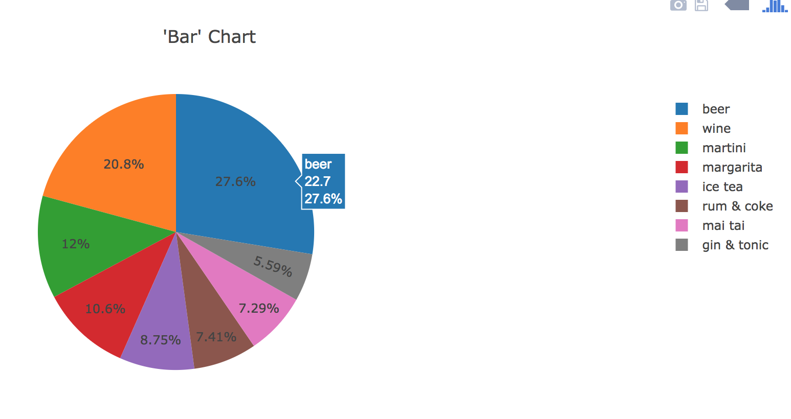
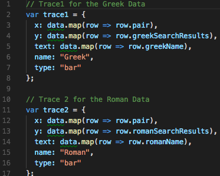
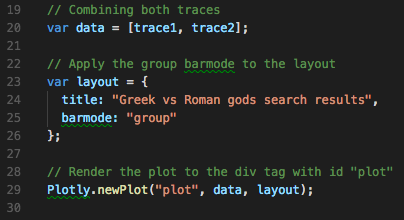
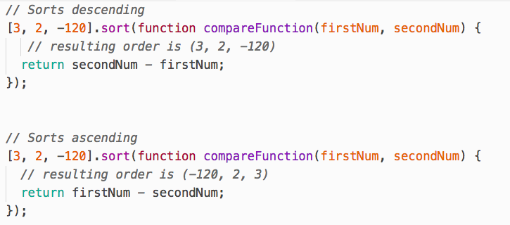
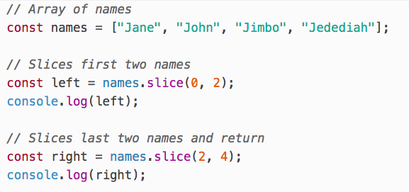
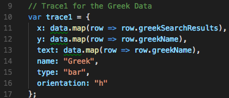
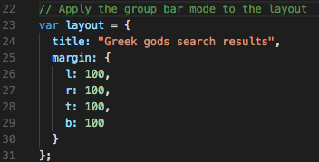
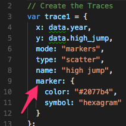

## 15.1 Lesson Plan - Introduction to Plotly.js

### Overview

Today's lesson plan introduces students to [Plotly.js](https://plot.ly/javascript/), a high-level wrapper around d3.js.

### Class Objectives

* Students will be able to use arrow functions, `.map()`, and `forEach()` for data manipulation.

* Students will learn to use Plotly to create the fundamental charts: Box, scatter, bar, pie, and line plots.

* Students will use Plotly's `layout` object to customize the appearance of their charts.

* Students will annotate charts with labels; text; and hover info.

### Sample Class Video (Highly Recommended)

* To view an example class lecture visit (Note video may not reflect latest lesson plan):
  [Class Video 1](https://codingbootcamp.hosted.panopto.com/Panopto/Pages/Viewer.aspx?id=0e39a867-0756-4c57-a532-a8750107c96f)
  [Class Video 2](https://codingbootcamp.hosted.panopto.com/Panopto/Pages/Viewer.aspx?id=32ff022f-5002-4c58-9f97-a875013ea745)

- - -

### 1. Instructor Do: Welcome & Intro Slide Show (0:10) (Critical)

* Welcome students and check in to see how they are doing while opening the [thanksAPlot!.pptx](Slide-Shows/thanksAPlot!.pptx).

* Present the slide show while reassuring students that they will get additional javascript practice this week.

* Explain that learning JavaScript is a journey filled with challenges, but completing that journey can be incredibly rewarding. A data professional with a strong JavaScript background can be an extremely effective data storyteller by applying mechanisms for building interactivity to customer-facing visualizations.

* Slack out the following article that talks about the power of [interactive visualizations](https://www.forbes.com/sites/benkerschberg/2014/04/30/five-key-properties-of-interactive-data-visualization/).

* Slack out the following resource links for students to reference as they progress through the week's activities:

  * [Student Guide](../StudentGuide.md)

### 2. Everyone Do: Exploring ES6 (0:15) (Critical)

* This activity is designed as a guided exploration of the ES6 update. You may want to consider live coding the unsolved version along with students. The [Unsolved](Activities/01-Evr_ES6/Unsolved/) folder has the same code for parts 1 and 2. Be sure to cover the following points:

  * **Var vs. Let/Const**:

    ```js
    function logger() {
      console.log(x);
      var x = "hi";
    }
    logger();

    function logger2() {
      console.log(y);
      let y = "hello";
    }
    ```

  * In this example, `var` allows a variable to declared at the top of its scope, but it is not initialized with a value until the code reaches the line where it is typed. By contrast, `let` and `const` do not declare or initialize until the line they are typed.

  * **Const**:

    ```js
    const myPets = ["dog", "cat", "rabbit", "some endangered species of sea turtle"];

    // myPets = "ferret"; //This will not work - stops execution

    // myPets = ["wolf", "giraffe", "parrot"]; //This will not work either

    // HOWEVER, we can still manipulate Objects and Arrays!
    console.log("before: ", myPets);
    myPets.pop();
    console.log("after: ", myPets);
    ```

  * `const` means that the variable cannot be reassigned. This makes it clear to the person reading and writing the code that they cannot and should not reassign that value.

  * However, an array or object can still be modified. This is because the `const` points to the array or object and not the items inside of it. Think of this like a treasure chest. The `const` points to the chest, so you can't swap that with another chest. However, you can still open the chest and add or remove treasure.

### 3. Instructor Do: Basic Plots with Plotly (0:15) (Critical)

* **Files:** [Activities/02-Ins_Basic_Plots/Solved](Activities/02-Ins_Basic_Plots/Solved)

* In this activity, you will demonstrate the basic plots possible with the Plotly library.

* Open `index.html` in your browser:

  

  * This is a "Bar" chart plotting various types of drinks against the percentages of drinks ordered at a bar.

* Now open `plots.js` and walk through the code:

  

#### Part 1: Basic Plot

* In Plotly, the term `trace` refers to an object that contains 1) data to be plotted, and 2) specifications for plotting. Ask the class what `trace1` consists of:

  * Data for the x-axis: labels for each drink, presented as a key value pair of `x` and an array of drinks.

  * Data for the y-axis, again organized as a key-value pair.

  * A specification for the type of the chart.

* Point out that in `var data = [trace1];`

  * `trace1` is enclosed in an array. We can also include multiple traces to plot them in the same chart, as we will see later.

* In the last line of the script, we use the `Plotly.newPlot()` method to plot our chart. It takes three arguments.

  * The first, `"plot"` refers to the `id` of the `div` where the plot will be displayed.

  

  * The second argument, `data`, refers to our trace.

  * The last argument, `layout`, is optional and refers in this case to the title displayed in the chart.

#### Part 2: Adding Axis Labels

* Comment out the code from Part 1 and uncomment the code from Part 2 in `plots.js`. Reload `index.html`. Bring to students' attention that we've now added labels for x- and y-axes.

  

* In the code, we have simply added `xaxis` and `yaxis` specifications to the `layout` object:

  

#### Part 3: A Line Chart

* Comment out the code from Part 2 and uncomment the code from Part 3. Load `index.html` again:

  

* In the code, the only change to take place was the `type: "line"`, in contrast to `type: "bar"` from the bar chart.

  

#### Parts 4 and 5: A Pie Chart (optional)

* In order to create a pie chart, can we simply change the specification to `type: "pie"`? No, and doing so will lead to a blank chart.

* Uncomment the code in Part 5 and reload the page. A pie chart!

  

* Slack out the link to the pie chart documentation <https://plot.ly/javascript/pie-charts/> and ask the class how they might fix our broken pie chart.

* Show the code to the class:

  

  * In `trace1`, instead of `x` and `y`, we use the keys `labels` and `values`.

  * Of course, we also specify the type of chart as `'pie'`.

* Answer any questions before moving on.

### 4. Students Do: A Flicker of the Eye (0:20)

* **Files:** [Activities/03-Stu_First_Chart/Unsolved](Activities/03-Stu_First_Chart/Unsolved)

* In this activity, students will create eye color versus the frequency of eye flickers.

### 5. Instructor Do: Review Activity (0:05)

* Open the [Activities/03-Stu_First_Chart/Solved/plots.js](Activities/03-Stu_First_Chart/Solved/plots.js). Much of the activity is easy to follow, with one quirk: we have multiple data points for each eye color, but Plotly does not plot them all. It does not even aggregate them. Instead, it plots only the last value listed for each eye color.

  * For example, for "Brown", the final flicker value listed in the CSV is 24.5.

* A more meaningful approach to plotting may be to take the average of each eye color.

### 6. Instructor Do: Plotting Multiple Traces (0:05)

* This activity is a quick demonstration of adding multiple traces to a Plotly chart.

* Open [Activities/04-Ins_Multi_Trace/Solved/index.html](Activities/04-Ins_Multi_Trace/Solved/index.html) in a browser and demonstrate that we have two line plots of randomly generated numbers (since they're randomly generated, they may be different from the below):

  

* Open [Activities/04-Ins_Multi_Trace/Solved/plots.js](Activities/04-Ins_Multi_Trace/Solved/plots.js). Optionally, discuss the random generator function:

  

  * First, an empty array is created.

  * The function takes as its argument a number `n` that will determine the size of the array.

  * During each iteration of a for-loop, a random number between 0 and 1, inclusive is generated, rounded down to the nearest integer with `Math.floor()`, then multiplied by 10 to result in random integers between 0 and 10. It is then appended to the array of random numbers.

* Explain the rest of the code:

  

  * Each of the two traces plots five randomly generated integers against the same x-axis, an array.

  * Both `trace1` and `trace2` are assigned to an array called `data` and charted as a scatter plot.

  * In the last line of the code, we see two arguments: `"plot"` and `data`. A possible third argument would have been used to specify the layout, but was omitted. The layout therefore follows Plotly's default settings.

### 7. Students Do: Multiple Traces (0:15) (High)

* **Files** [Activities/05-Stu_Multi_Trace/Unsolved](Activities/05-Stu_Multi_Trace/Unsolved)

* **Instructions**

  * In ancient Rome, their gods were often counterparts or imports of Greek gods. For example, the Greek god Zeus became in Rome Jupiter via an etymological transformation from Zeus to Zeus Pater ("Father Zeus") to Iupiter (classical Latin lacked a "J" consonant).

  * In today's world, are these gods better known by their Roman names or Greek names? To answer this question, your task is to plot the number of search results, of both Roman and Greek names, returned for each god.

  * To accomplish this task, you will need to create two traces, one for Roman gods, and another for Greek gods.

  * In order to define the data for each plot point in a trace, use the `map()` method on the dataset.

  * Examine `data.js` to determine how you will do this.

### 8. Instructor Do: Review Multiple Traces Activity (0:05)

* This was a fairly challenging activity, as it requires using functional programming techniques. Open the [solution](Activities/05-Stu_Multi_Trace/Solved/plots.js).

* For the first trace, which deals with Greek gods, defining the x-axis points can be accomplished by using `map()` to return the `pair` value from the dataset.

  

* Explain that `row => row.pair` is, here, essentially a shortcut to writing `function (row) {return row.pair;}`

* Using `map()`, we transform each row in the dataset to its `pair` attribute.

  * `x` becomes an array of `row.pair` values.

  

* The second trace likewise deals with Roman gods:

  

* The rest of the code should be familiar to students:

  

### 9. Instructor Do: Sorting and Slicing (0:10)

* Instructor Note:  It is highly recommend that this activity is live coded.

* Open [Activities/06-Ins_Sort_Slice/Solved/sorting.js](Activities/06-Ins_Sort_Slice/Solved/sorting.js).

* Explain that, to sort an array in JavaScript, we call its `sort` method.

  * Explain that, when we call `sort`, we must pass it a callback specifying _how_ to sort.

  

* Explain that `compareFunction` compares pairs of elements in the input array: E.g., `[3, 2]`, or `[2, -120]`.

  * Explain that, if the compare function returns a _positive_ number for a given pair of numbers `[a, b]`, it will put them in the reverse order in the final array: `[b, a]`.

  * Explain that, if the compare function returns a _negative_ number for a given pair `[a, b]`, it will put them in the input order in the final array: `[a, b]`.

  * The key of whether a sort is `ascending` or `descending` lies in the difference being returned. Given `[a,b]` returning `b-a` will result in a `descending` sort since it will return _positive_ when `b>a` resulting in a change in order. Returning `a-b` will result in an `ascending` sort since it will return _negative_ when `a<b` therefore keeping its original order. If `a>b`, `a-b` results in a positive and then changes the order to `[b,a]`.

  * Answer any questions before showing the next file.

* Emphasize that `sort` modifies the array it's called on **in place**.

  * Point out that it is often safer to sort a _copy_ of an array, rather than the input itself.

* Open [Activities/06-Ins_Sort_Slice/Solved/slicing.js](Activities/06-Ins_Sort_Slice/Solved/slicing.js).

* Explain that one way to copy a subarray is to use the `slice` method.

  * Explain that `slice` produces _shallow_ copies.

  

* Let students know that they will use these concepts in a graphing activity after break.

- - -

### 10. BREAK (0:15)

- - -

### 11. Students Do: Horizontal Bar Chart (0:20)

* **Files**

  * [index.html](Activities/07-Stu_HBar/Unsolved/index.html)

  * [plots.js](Activities/07-Stu_HBar/Unsolved/plots.js)

  * [data.js](Activities/07-Stu_HBar/Unsolved/data.js)

* **Instructions**

  * Sort the data array of objects by `greekSearchResults`.

  * Slice the top 10 objects from the array.

  * Create a horizontal bar chart that plots the top 10 greek gods based on their search results in descending order.

* **Hints**

* Use the following links to help you figure out how to sort the array of objects by the `greekSearchResults` values.

  * [Stackoverflow sorting objects](https://stackoverflow.com/a/979289)

  * [mdn docs on the sort function](https://developer.mozilla.org/en-US/docs/Web/JavaScript/Reference/Global_Objects/Array/sort)

* After sorting, slice the first 10 objects for your plots.

  * [mdn docs on the slice function](https://developer.mozilla.org/en-US/docs/Web/JavaScript/Reference/Global_Objects/Array/slice)

### 12. Everyone Do: Review Activity (0:10)

* Open up [index.html](Activities/07-Stu_HBar/Solved/index.html) and [plot.js](Activities/07-Stu_HBar/Solved/plots.js) Point out that we start by sorting `data`.

  * Review the role of the compare function.

  * Point out that we must use `parseFloat` to convert the `greekSearchResults` string property to a number for sorting.

* Point out the use of `slice` to copy a subset of `data`.

  

* Plotly graphs horizontal bar charts from bottom to top, so we also need to use `data.reverse()` in order to get the graph to look like the data is descending on the graph.

* Point out that `orientation: h` in `trace1` creates a **h**orizontal bar chart.

  

* Point out that we can set the size of the margins in the `layout` object.

  

### 13. Instructor Do: Demo Scatter Plots (0:05)

* Demonstrate the solved [index.html](Activities/08-Stu_Scatter/Solved/index.html).

  * While showing them the graph in the browser, point out that the final plot includes multiple traces.

* Explain that the next activity requires students to use the Plotly documentation to create a multi-trace scatter plot.

### 14. Students Do: Scatter Plots (0:20) (High)

* **Files**

  * [plots.js](Activities/08-Stu_Scatter/Unsolved/plots.js)

  * [data.js](Activities/08-Stu_Scatter/Unsolved/data.js)

  * [index.html](Activities/08-Stu_Scatter/Unsolved/index.html)

* **Instructions**

  * Alter the html to incorporate a div to hold you plot as well as the script tags to incorporate `data.js` and `plot.js` files.

  * Create a scatter plot to plot the `high_jump`, `discus_throw`, and `long_jump` vs the `year`.

  * Use three separate traces for this data.

* **Bonus**

  * Customize the marker colors and symbol for each trace.

* **Hint**

### 15. Everyone Do: Review Scatter Plots Activity (0:10)

* Open the solved [plots.js](Activities/08-Stu_Scatter/Solved/plots.js).

* Explain that, to configure a scatter plot, we simply configure each trace's `type` key as `scatter`.

* Point out that we can configure the appearance of each trace's markers by using the `marker` key.

  

* Demonstrate that viewers can isolate traces by clicking on the name in the legend.

  * Point out that viewing a trace in isolation makes its trend line more obvious, but that viewing traces in juxtaposition makes it clear which category had the most improvement over time.

  * Emphasize that visualization is a critical step in data exploration and analysis because it makes such trends clear at a glance.

- - -

### LessonPlan & Slideshow Instructor Feedback

* Please click the link which best represents your overall feeling regarding today's class. It will link you to a form which allows you to submit additional (optional) feedback.

* [:heart_eyes: Great](https://www.surveygizmo.com/s3/4381674/DataViz-Instructor-Feedback?section=15.1&lp_useful=great)

* [:grinning: Like](https://www.surveygizmo.com/s3/4381674/DataViz-Instructor-Feedback?section=15.1&lp_useful=like)

* [:neutral_face: Neutral](https://www.surveygizmo.com/s3/4381674/DataViz-Instructor-Feedback?section=15.1&lp_useful=neutral)

* [:confounded: Dislike](https://www.surveygizmo.com/s3/4381674/DataViz-Instructor-Feedback?section=15.1&lp_useful=dislike)

* [:triumph: Not Great](https://www.surveygizmo.com/s3/4381674/DataViz-Instructor-Feedback?section=15.1&lp_useful=not%great)

- - -

### Copyright

Trilogy Education Services © 2018 All Rights Reserved.
