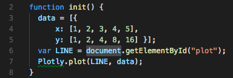
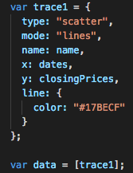
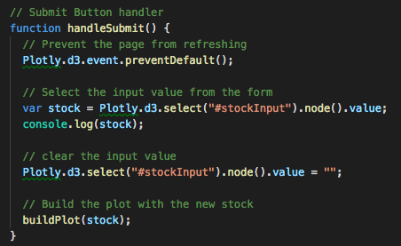
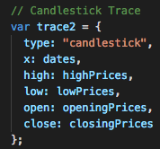

## 15.2 Lesson Plan - Plotly Advanced Charts

### Overview

Today's class will introduce students to advanced charts with Plotly, focusing on advanced features like custom tick labels, layouts, colors, dropdowns, and click events.

### Instructor Priorities

* Students should be able to successfully manipulate their charts through dropdown events.
* Students should be able to successfully manipulate their charts through button events
* Students should be able to successfully manipulate their charts through click events.
* Students should be able to successfully use Plotly.restyle.

### Sample Class Video (Highly Recommended)

* To view an example class lecture visit (Note video may not reflect latest lesson plan): [Class Video](https://codingbootcamp.hosted.panopto.com/Panopto/Pages/Viewer.aspx?id=dd93910c-65f3-4314-9ab1-671156df9396)

### Class Objectives

* Students will learn to create and manipulate advanced Plotly charts.

- - -

### 01. Instructor Do: Welcome Class & Plotly Review (0:05)

* Welcome everyone to class. Take a minute to explain that today we are going to continue building on our plotly knowledge, by expanding our charts with more advanced features.

* Take a few minutes to review the fundamentals of Plotly.js:

  * All charts are created using JSON objects.

  * Every property of the chart has a corresponding JSON attribute that can be used customize the appearance and behavior.

  * Attributes can be divided into two categories.

    * `traces`: Objects that are used to provide information about a single series of the data to be plotted on the graph.

    * `layout`: Provides different attributes that control elements like title and annotations.

  * Traces can be further categorized by the chart type, and the attributes available for customization will depend on the value of the type attribute.

### 02. Instructor Do: Dropdown Events (0:05) (Critical)

* Demonstrate [index.html](Activities/01-Ins_Dropdown_Events/Solved/index.html) in the browser.

  * Point out that this interface allows users to select which data set to render via the dropdown in the bottom-left corner.

* Open [index.html](Activities/01-Ins_Dropdown_Events/Solved/index.html) in your text editor.

* Point out that we attach the attribute `onchange="getdata(this.value)` to our `select` element.

  * Explain that this attaches an event handler that fires when the change event is fired on the `select` element.

* Explain that, whenever this function gets called, the browser will pass the currently selected item from the dropdown as its argument.

  

* Point out that, in order for the browser to call `getData` whenever the selection is changed, we must define the function ourselves.

* Open [plots.js](Activities/01-Ins_Dropdown_Events/Solved/plots.js) in your text editor, and scroll to the definition of `getData`.

* Remind students that `getData` receives the currently selected item from the select element as its argument.

  * Point out that `dataset` can have the values `dataset1`, `dataset2`, or `dataset3`.

  * Point out that this is due to the values provided for the `value` attribute of each of the select element's `option` elements.

  

* Point out that the `switch` statement sets the values for our `x` and `y` axes as a function of which of the three datasets is selected.

* Point out that we update the data rendered in the plot by calling `updatePlotly` after assigning values to `x` and `y`.

* Explain that `updatePlotly` retrieves the element containing our plot, then uses [Plotly.restyle](https://plot.ly/javascript/plotlyjs-function-reference/#plotlyrestyle) to update the values rendered on its its x and y axes.

  * **WARNING!** Emphasize that `Plotly.restyle` requires that you wrap all of the data in an extra set of square brackets.

  

* Finally, explain that `init` is responsible for rendering the initial data in the plot.

  

### 03. Students Do: Dropdown Events (0:10)

* **Files**

  * [index.html](Activities/02-Stu_Dropdown_Events/Unsolved/index.html)

  * [plots.js](Activities/02-Stu_Dropdown_Events/Unsolved/plots.js)

* **Instructions**

  * [README.md](Activities/02-Stu_Dropdown_Events/README.md)

### 04. Everyone Do: Review Activity (0:05)

* Demonstrate the solved [index.html](Activities/02-Stu_Dropdown_Events/Solved/index.html) in the browser.

* Open the solved [plots.js](Activities/02-Stu_Dropdown_Events/Solved/plots.js) in the browser.

* Point out that the code in the solution is analogous to that in the preceding demonstration.

* Take a moment to address any student questions before slacking out the solution and moving on.

### 05. Instructor Do: D3.json (0:05) (Critical)

* **Files**

  * [index.html](Activities/03-Ins_D3_JSON/Solved/index.html)

  * [plots.js](Activities/03-Ins_D3_JSON/Solved/demo.js)

* Explain to students that D3.js provides a function to fetch JSON data from APIs on the web.

* Visit the [spacex api](https://api.spacexdata.com/v2/launchpads) to show the JSON data.

* Live code or walk through demo and highlight the following:

  ```javascript
  const url = "https://api.spacexdata.com/v2/launchpads";

  // Fetch the JSON data and console log it
  d3.json(url).then(function(data) {
    console.log(data);
  });
  ```

  * `d3.json` is very similar to Python `requests.get`.

  * `d3.json` returns a JavaScript promise.

* Use the second example to explain the concept of promises in JavaScript:

  ```javascript
  // Promise Pending
  const dataPromise = d3.json(url);
  console.log("Data Promise: ", dataPromise);
  ```

  * The data from a promise is only available inside of the `.then` function.

  * The `dataPromise` variable is assigned a promise of future data, but the data must be accessed inside of the `.then` function.

### 06. Instructor Do: Stock Prices Time Series Activity (0:05)

* Demonstrate the solved [index.html](Activities/04-Stu_Stocks/Solved/index.html) in the browser.

* Explain that, in this activity, students will have to use the [Quandl API](https://docs.quandl.com/) to fetch stock data.

  * Emphasize that students **must sign up for their own API key to complete the day's activities**.

* Explain the example request on the [Time Series Usage](https://docs.quandl.com/docs/in-depth-usage) page.

```bash
# Note the ticker symbol (FB) and the API KEY at the end of the URL
curl "https://www.quandl.com/api/v3/datasets/WIKI/FB/data.json?api_key=YOURAPIKEY"
```

### 07. Students Do: Stock Prices Time Series (0:15)

* Emphasize that students must sign up for their own API key to complete this activity.

* **Files**

  * [index.html](Activities/04-Stu_Stocks/Unsolved/index.html)

  * [plots.js](Activities/04-Stu_Stocks/Unsolved/plots.js)

* **Instructions**

  * [README.md](Activities/04-Stu_Stocks/README.md)

### 08. Everyone Do: Review Stock Prices Time Series Activity (0:05)

* Demonstrate the solved [index.html](Activities/04-Stu_Stocks/Solved/index.html) in the browser.

* Open the solved [plots.js](Activities/04-Stu_Stocks/Solved/plots.js) in your code editor.

* Point out that the solution to this activity follows the following pattern:

  * Retrieve data from Quandl via `d3.json`

  * Unpack data from the response data

  * Create and render `trace`, `data`, and `layout` objects with the unpacked data

* Explain that we use [template strings](https://developer.mozilla.org/en-US/docs/Web/JavaScript/Reference/Template_literals) to build the base `url` that we use for requests.

  

* Explain that, in `buildPlot`, we can use dot notation and `unpack` to extract the necessary data from the response.

  

* Point out that the rest of the code is familiar from our previous plots: Simply set the `x` and `y` keys in our `trace1` object, which we use to create the `data` array we pass to Plotly.

  

### 09. Instructor Do: Dynamically Selected Stocks (0:05)

* Demonstrate the solved [index.html](Activities/05-Stu_Stocks_Dynamic/Solved/index.html) in the browser.

* Point out that this plot generates a simple time series, but that the user is able to determine the stock whose closing prices to plot dynamically.

* Explain that, to solve this challenge, students will have to:

  * Select the submit button

  * Attach a handler to the button, which collects the user's selected ticker when clicked

  * Use the user's selected ticker to retrieve stock data from Quandl

  * Create `data` and `layout` objects with the response data, and render the results to the page

### 10. Students Do: Dynamically Selected Stock Plots (0:15)

* **Files**

  * [index.html](Activities/05-Stu_Stocks_Dynamic/Unsolved/index.html)

  * [plots.js](Activities/05-Stu_Stocks_Dynamic/Unsolved/plots.js)

* **Instructions**

  * [README.md](Activities/05-Stu_Stocks_Dynamic/README.md)

### 11. Everyone Do: Review Dynamic Stocks Activity (0:05)

* Demonstrate the solved [index.html](Activities/05-Stu_Stocks_Dynamic/Solved/index.html) in the browser.

* Open the solved [plots.js](Activities/05-Stu_Stocks_Dynamic/Solved/plots.js) in your text editor.

* Explain the overall structure of the solution:

  * First, we attach a click handler to the `#submit` button, configuring it to execute `handleSubmit` whenever a user clicks on it.

  

* Whenever the user clicks the button and triggers `handleSubmit`, the code:

  * Calls `preventDefault`, to prevent the page from reloading

  * Collects the user's selected stock from the form

  * Clears the form by resetting the input's `value` attribute to the empty string

  * Calls `buildPlot` with the user's selected `stock` ticker.

  =

### 12. Instructor Do: Candlestick Charts (0:10)

* Demonstrate the solved [index.html](Activities/06-Stu_Stocks_CandleStick/Solved/index.html) in the browser.

* Point out that this chart displays the time series of closing price data, but also a series of "candles" representing additional data for each day.

* Explain that the top and bottom of each candle represent the **closing** and **opening** prices for the stock.

  * Explain that whichever price is lower is used to draw the bottom boundary for the candle.

  * Explain that whichever price is higher is used to draw the upper boundary for the candle.

  * Explain that, when the closing price is _higher_ than the opening price, the candle is colored _red_.

  * Explain that, when the closing price is _lower_ than the opening price, the candle is colored _orange_.

  * Point out that this allows financial analyst to determine if a stock is bearish or bullish on a given day by simply glancing at the color of its candle.

* Explain that the "wicks" outside of the candlesticks represent the **high** and **low** prices for the day.

* Point out that candlestick charts are useful because they summarize all of the fundamental figures describing a series of prices in a single plot.

  * Point out that candlestick charts are even more informative when plotted on top of the time series that generates them.

* Explain that, to generate a candlestick chart for a given stock with Plotly, students will need to:

  * Retrieve high; low; opening; and closing prices for the stock, and

  * Use these prices to define trace objects.

### 13. Students Do: Candlestick Charts Activity (0:15)

* **Files**

  * [index.html](Activities/06-Stu_Stocks_CandleStick/Unsolved/index.html)

  * [plots.js](Activities/06-Stu_Stocks_CandleStick/Unsolved/plots.js)

* **Instructions**

  * [README.md](Activities/06-Stu_Stocks_CandleStick/README.md)

### 14. Everyone Do: Review Candlestick Activity (0:05)

* Demonstrate the solved [index.html](Activities/06-Stu_Stocks_CandleStick/Solved/index.html) in the browser.

* Open the solved [plots.js](Activities/06-Stu_Stocks_CandleStick/Solved/plots.js).

* Point out that the majority of the code in this solution is familiar, with the new elements being the trace properties required to generate the candlestick chart.

  * Point out `high`, `low`, `open`, and `close` as the new properties in `trace2`.

  

- - -

### 15. BREAK (0:15)

- - -

### 16. Instructor Do: Rolling Averages (0:05)

* Demonstrate the solved [index.html](Activities/07-Stu_Stocks_Rolling_Avg/Solved/index.html) in the browser.

  * Recall that you will have to enter a stock ticker in the corner input to generate the plot.

* Explain that this plot depicts the time series generated by the ticker's closing prices; a candlestick chart generated from the high, low, opening, and closing prices; and a line plot of rolling averages.

  * Point out that the rolling average reflects the overall trends of the underlying closing prices, but that the curve is much smoother.

* Remind students that this kind of **smoothing** is the motivation for rolling averages.

  * Remind students that, to take a rolling average of the closing prices, we essentially replace each price with the average price around it:

```js
// Prices
var prices = [20, 30, 22, 25, 28, 32]

// window length = 3
var rollingAverages = [
  // prices[0] + prices[1] + prices[2]
  (20 + 30 + 22) / 3,
  // prices[1] + prices[2] + prices[3]
  (30 + 22 + 25) / 3,
  // prices[2] + prices[3] + prices[4]
  (22 + 25 + 28) / 3,
  // prices[3] + prices[4] + prices[5]
  (25 + 28 + 32) / 3
]
```

* Explain that this "smooths" the price data, which filters out noise and emphasizes essential trends in the data.

### 17. Students Do: Rolling Averages of Stock Prices (0:15) (Low)

* **Files**

  * [index.html](Activities/07-Stu_Stocks_Rolling_Avg/Unsolved/index.html)

  * [plots.js](Activities/07-Stu_Stocks_Rolling_Avg/Unsolved/plots.js)

* **Instructions**

  * [README.md](Activities/07-Stu_Stocks_Rolling_Avg/README.md)

### 18. Everyone Do: Review Rolling Averages Activity (0:05)

* Demonstrate the solved [index.html](Activities/07-Stu_Stocks_Rolling_Avg/Solved/index.html) in the browser.

  * Remind students that a rolling average replaces every data point with an _average_ for the last `N` days.

  * Remind students that we can vary the number of data points, called the **window**, we average when calculating a rolling average.

  * Remind students that a rolling average "smooths out" the underlying data set, removing noise and retaining signal.

```js
function rollingAverage(arr, windowPeriod = 10) {
  // rolling averages array to return
  var averages = [];

  // Loop through all of the data
  for (var i = 0; i < arr.length - windowPeriod; i++) {
    // calculate the average for a window of data
    var sum = 0;
    for (var j = 0; j < windowPeriod; j++) {
      sum += arr[i + j];
    }
    // calculate the average and push it to the averages array
    averages.push(sum / windowPeriod);
  }
  return averages;
}
```

* Point out that, to render the plot, we must enter a stock ticker in the corner input, and click **Submit**.

  * Explain that `handleSubmit` grabs the user's selected ticker, and `buildPlot` sends a request to the Quandl API and renders the plot.

  * Remind students that a _click listener_ on the submit button fires on click, collecting the ticker the user specified, and then sending an API request to Quandl to retrieve data on the ticker.

```js
function handleSubmit() {
  // Prevent the page from refreshing
  d3.event.preventDefault();

  // Select the input value from the form
  var stock = d3.select("#stockInput").node().value;
  console.log(stock);

  // clear the input value
  d3.select("#stockInput").node().value = "";

  // Build the plot with the new stock
  buildPlot(stock);
}
```

* Point out that, after collecting the user's selected ticker, the next steps are to \_collect data

```js
function buildPlot(stock) {
  var url = `https://www.quandl.com/api/v3/datasets/WIKI/${stock}.json?start_date=2016-10-01&end_date=2017-10-01`;

  d3.json(url).then(function(response) {

    // Grab values from the response json object to build the plots
    var name = response.dataset.name;
    var stock = response.dataset.dataset_code;
    var startDate = response.dataset.start_date;
    var endDate = response.dataset.end_date;
    var dates = unpack(response.dataset.data, 0);
    var openingPrices = unpack(response.dataset.data, 1);
    var highPrices = unpack(response.dataset.data, 2);
    var lowPrices = unpack(response.dataset.data, 3);
    var closingPrices = unpack(response.dataset.data, 4);
    var rollingPeriod = 30;
    var rollingAvgClosing = rollingAverage(closingPrices, rollingPeriod);

    var trace1 = {
      type: "scatter",
      mode: "lines",
      name: name,
      x: dates,
      y: closingPrices,
      line: {
        color: "#17BECF"
      }
    };

    // Candlestick Trace
    var trace2 = {
      type: "candlestick",
      x: dates,
      high: highPrices,
      low: lowPrices,
      open: openingPrices,
      close: closingPrices
    };

    // Rolling Averages Trace
    var trace3 = {
      type: "scatter",
      mode: "lines",
      name: "Rolling",
      x: dates.slice(rollingPeriod),
      y: rollingAvgClosing
    };

    var data = [trace1, trace2, trace3];

    var layout = {
      title: `${stock} closing prices`,
      xaxis: {
        range: [startDate, endDate],
        type: "date"
      },
      yaxis: {
        autorange: true,
        type: "linear"
      }
    };

    Plotly.newPlot("plot", data, layout);
  });
}
```

* Remind students that `buildPlot` is responsible for making the AJAX call to Quandl, and rendering the plot.

  * Point out that `d3.json` fetches the data from Quandl.

  * Point out that we retrieve the data stored in each column with `unpack`.

  * Point out that, after unpacking, the rest of the pipeline is standard Plotly: Create `data` and `layout`, then render the plot into `myDiv`.

```js
function buildPlot(stock) {
  var url = `https://www.quandl.com/api/v3/datasets/WIKI/${stock}.json?start_date=2016-10-01&end_date=2017-10-01`;

  d3.json(url).then(function(response) {

    // Grab values from the response json object to build the plots
    var name = response.dataset.name;
    var stock = response.dataset.dataset_code;
    var startDate = response.dataset.start_date;
    var endDate = response.dataset.end_date;
    var dates = unpack(response.dataset.data, 0);
    var openingPrices = unpack(response.dataset.data, 1);
    var highPrices = unpack(response.dataset.data, 2);
    var lowPrices = unpack(response.dataset.data, 3);
    var closingPrices = unpack(response.dataset.data, 4);
    var rollingPeriod = 30;
    var rollingAvgClosing = rollingAverage(closingPrices, rollingPeriod);

    var trace1 = {
      // ...
    };

    // Candlestick Trace
    var trace2 = {
      // ...
    };

    // Rolling Averages Trace
    var trace3 = {
      /// ...
    };

    var data = [trace1, trace2, trace3];

    var layout = {
      // ...
    };

    Plotly.newPlot("plot", data, layout);
  });
}
```

### 19. Instructor Do: Stock Report (0:05)

* Demonstrate the solved [index.html](Activities/08-Stu_Stocks_Report/Solved/index.html) in the browser.

* Explain that this report uses stock data retrieved via API to generate both the interactive chart and the data table on the bottom of the page.

  * Point out that the chart includes both a scatter plot of the stock's closing prices, as well as a candlestick chart generated from high/low and open/close data.

  * Point out that the data table summarizes monthly aggregate data rather than daily price figures.

### 20. Partners Do: Stock Report (0:20)

* **Files**

  * [bootstrap.min.css](Activities/08-Stu_Stocks_Report/Unsolved/bootstrap.min.css)

  * [index.html](Activities/08-Stu_Stocks_Report/Unsolved/index.html)

  * [plots.js](Activities/08-Stu_Stocks_Report/Unsolved/plots.js)

* **Instructions**

  * [README.md](Activities/08-Stu_Stocks_Report/README.md)

### 21. Everyone Do: Review Stock Report Activity (0:05)

* Demonstrate the solved [index.html](Activities/08-Stu_Stocks_Report/Solved/index.html) in the browser.

* Open the solved [plots.js](Activities/08-Stu_Stocks_Report/Solved/plots.js).

* Point out that this activity required students to create an interactive dashboard and a dynamically generated table.

* Explain that `buildPlot` takes the following steps to render the report:

  * Fetch stock data from Quandl

  * Unpack data from the response

  * Fetch monthly aggregate data to generate the table

  * Create traces with the Quandl stock data

  * Render `data` and `layout` objects into `plot`.

* Explain that these steps are mostly familiar from previous activities, with the exception of the step where we fetch monthly aggregate data and generate a table.

  * Explain that the function `getMonthlyData` retrieves stock data aggregated by month; unpacks the data; and then passes it to `buildTable` to generate an HTML table.

```js
function getMonthlyData() {

  queryUrl = `https://www.quandl.com/api/v3/datasets/WIKI/AMZN.json?start_date=2016-10-01&end_date=2017-10-01&collapse=monthly&api_key=${apiKey}`;
  d3.json(queryUrl).then(function(response) {
    var dates = unpack(response.dataset.data, 0);
    var openPrices = unpack(response.dataset.data, 1);
    var highPrices = unpack(response.dataset.data, 2);
    var lowPrices = unpack(response.dataset.data, 3);
    var closingPrices = unpack(response.dataset.data, 4);
    var volume = unpack(response.dataset.data, 5);
    buildTable(dates, openPrices, highPrices, lowPrices, closingPrices, volume)
  });
}
```

* Explain that `buildTable` creates and appends new table row to the `#summary-table` for each month in the aggregated monthly stock data.

```js
function buildTable(dates, openPrices, highPrices, lowPrices, closingPrices, volume) {
  var table = d3.select("#summary-table");
  var tbody = table.select("tbody");
  var trow;
  for (var i = 0; i < 12; i++) {
    trow = tbody.append("tr");
    trow.append("td").text(dates[i]);
    trow.append("td").text(openPrices[i]);
    trow.append("td").text(highPrices[i]);
    trow.append("td").text(lowPrices[i]);
    trow.append("td").text(closingPrices[i]);
    trow.append("td").text(volume[i]);
  }
}
```

- - -

### LessonPlan & Slideshow Instructor Feedback

* Please click the link which best represents your overall feeling regarding today's class. It will link you to a form which allows you to submit additional (optional) feedback.

* [:heart_eyes: Great](https://www.surveygizmo.com/s3/4381674/DataViz-Instructor-Feedback?section=15.2&lp_useful=great)

* [:grinning: Like](https://www.surveygizmo.com/s3/4381674/DataViz-Instructor-Feedback?section=15.2&lp_useful=like)

* [:neutral_face: Neutral](https://www.surveygizmo.com/s3/4381674/DataViz-Instructor-Feedback?section=15.2&lp_useful=neutral)

* [:confounded: Dislike](https://www.surveygizmo.com/s3/4381674/DataViz-Instructor-Feedback?section=15.2&lp_useful=dislike)

* [:triumph: Not Great](https://www.surveygizmo.com/s3/4381674/DataViz-Instructor-Feedback?section=15.2&lp_useful=not%great)

- - -

### Copyright

Trilogy Education Services © All Rights Reserved.
