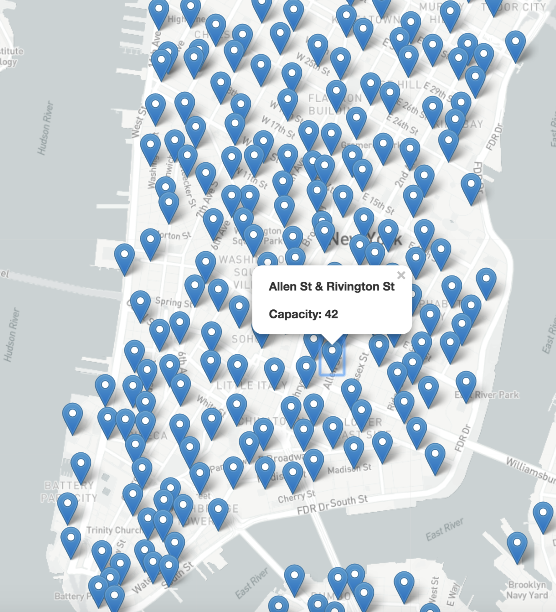
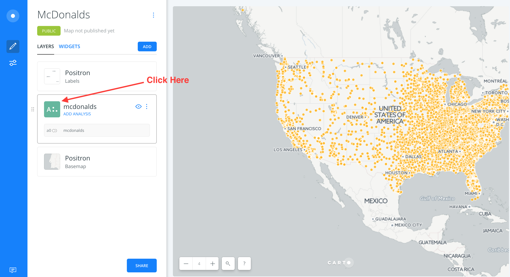
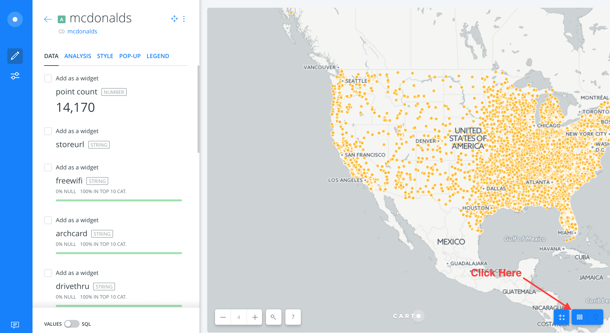
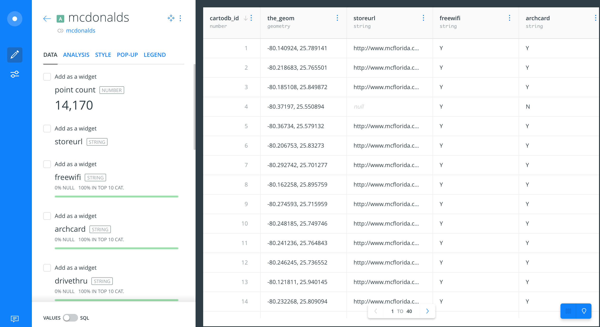
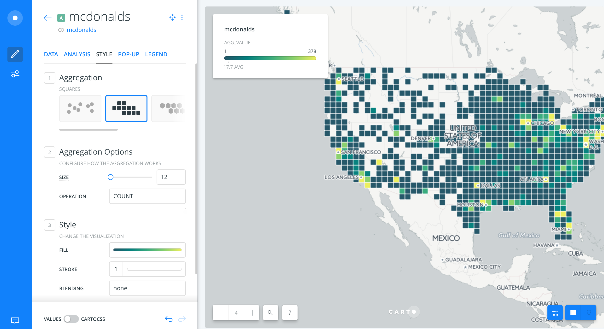
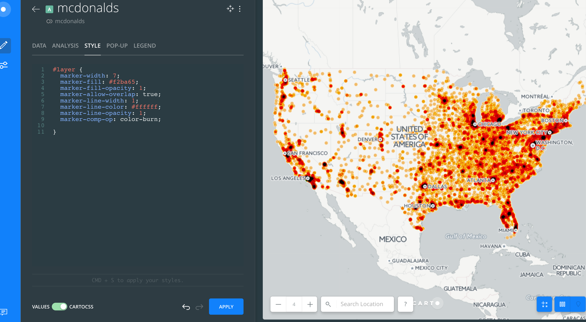
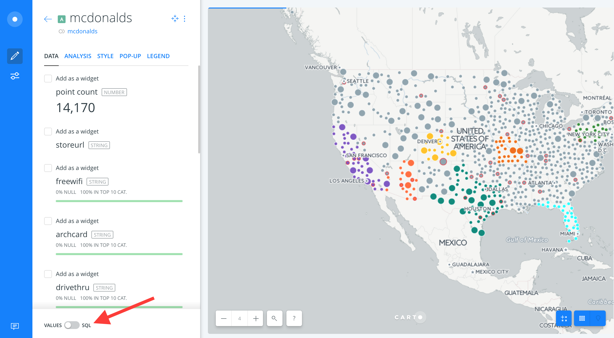
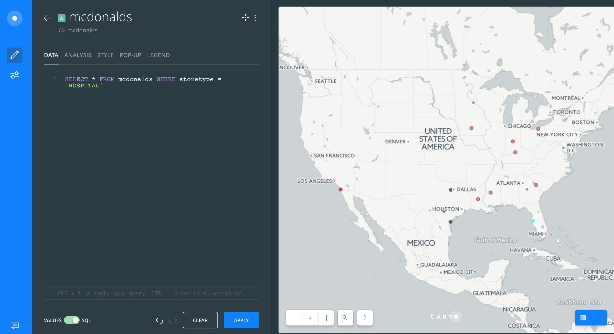

## 17.3 – Intro to CARTO & More Leaflet

### Overview

In this class, students will further develop their Leaflet skills by working on a mini-project in which they will map Citi Bike data. During the second half of the class, we will give students a hands-on introduction to CARTO. We will plot McDonald's location data and create an analysis of lead-related complaints throughout New York's five boroughs. Finally the class will finish with some review time and go over any exercises they thought were difficult.

## Instructor Priorities

* Students should have the time to further develop their Leaflet skills by creating a map of all of the Citi Bike Stations in New York.

* Students should understand the basics of creating maps with CARTO.

* Students will have a chance to review material from the previous weeks.

## Instructor Notes

* A large portion of time during the beginning of class is dedicated to students working on a Leaflet project. During that time, make sure TAs and yourself are walking around offering assistance to students who are stuck.

* Be sure to keep your unique Mapbox API token nearby; the provided code does not include an active token for today's activity.

* Try to spend some time before class familiarizing yourself with CARTO and the activities. A good part of today's lesson will involve you demonstrating CARTO's features live in class. Step-by-step instructions will be provided, but things will go more smoothly with some practice with CARTO beforehand.

* The final part of today's class will be review. This will be a great chance for students to go over material they found tough or confusing from the several previous weeks. This will be a great chance for students to finalize any last minutes questions before they start projects.

## Sample Class Video (Highly Recommended)

* To view an example class lecture visit (Note video may not reflect latest lesson plan): [Class Video](https://codingbootcamp.hosted.panopto.com/Panopto/Pages/Viewer.aspx?id=a954dd44-5a1f-4d2b-ad6e-a87500f73c41)

- - -

## Class Objectives

* Students will gain a Leaflet mastery by completing an in-class project.

* Student will learn the basics of creating maps with CARTO, including writing custom CSS and SQL queries to style and filter data, while also incorporating multiple data sets within the same map.

* Students will understand how different types of maps are better for visualizing different datasets.

- - -

## 1. Welcome Class (0:05)

* Inform students that we're going to spend the first half of class working on a project in Leaflet. In particular, we'll utilize the Citi Bike API to display information about Citi Bike Stations. Afterwards, we will introduce the class to CARTO, a platform that provides tools for creating and displaying thematic maps in a web browser.

## 2. Instructor Do: Introduce Citi Bike (0:10)

* Inform students that they'll be utilizing the Citi Bike API to create a Leaflet map displaying locations of Citi Bike Stations in New York. There are two versions of the activity, a basic version and a more advanced version, which will require two datasets from separate Citi Bike API endpoints. At a minimum, students should work to complete a basic version.

* Open the [Stu_Citi_Bike_Basic_Solved](Activities/01-Stu_CitiBike/Solved/Basic/index.html) then in terminal run `python -m http.server` and navigate to [http://127.0.0.1:8000/](http://127.0.0.1:8000/) in the browser to show students the basic version of the map made using only the first dataset.

  

  * Point out the following:

    1. Each marker is placed at the latitude and longitude returned by the request.

    2. When a marker is clicked, a popup appears displaying the station name and capacity.

* Take a moment to show students the response given back by the [Citi Bike API Station Information Endpoint](https://gbfs.citibikenyc.com/gbfs/en/station_information.json) used to create this map. Be sure to mention the following:

  1. This data is **not** GeoJSON because it doesn't include any features.

  2. This response does, however, include the longitude and latitude for each bike station, which is what we'll use to place our markers.

  3. The response also includes other useful information, such as the `name`, `station_id`, and `capacity` of each bike station.

  4. Go back and forth between this data and the map to illustrate how the returned data is being used.

* After answering any questions about the basic version of the map, shut down the server, open up [Stu_Citi_Bike_Adanced_Solved](Activities/01-Stu_CitiBike/Solved/Advanced/index.html) and restart the server with `python -m http.server`. Navigate to to [http://127.0.0.1:8000/](http://127.0.0.1:8000/) and show the class the advanced version of the map they will be working towards. Be sure to highlight the following functionality:

  1. This solution groups markers into layers according to station status, e.g. "Out of Order", "Coming Soon", or "Empty".

  2. Using a Leaflet plugin, different custom markers are used for each status group.

  3. Similar to the first example, when a marker is clicked, a popup appears. Additionally, we see the number of bikes available at each station along with the station name and total capacity.

  4. This version of the activity uses a map legend to display quantities of markers of each status, as well as their colors and the last time the API was updated.

  5. Stress that students complete the basic version of the activity before moving on to this more advanced version.

  

* Remind students that they'll need to perform a second API call in order to obtain all of the data needed to build this advanced map. The first was the [Citi Bike API Station Information Endpoint](https://gbfs.citibikenyc.com/gbfs/en/station_information.json), which we demonstrated with the basic map.

* Now show students the response given back by the [Citi Bike API Station Status Endpoint](https://gbfs.citibikenyc.com/gbfs/en/station_status.json). Be sure to highlight the following:

  1. This endpoint provides information about the status of each bike station, including the number of bikes available and whether or not the station is currently installed and renting bikes.

  2. This endpoint does not, however, provide coordinates for each bike station. This must still be obtained from the first endpoint we discussed, the [Citi Bike API Station Information Endpoint](https://gbfs.citibikenyc.com/gbfs/en/station_information.json).

  3. The stations in both API responses have corresponding `station_id` properties. This should make it easier to match up and utilize data in both datasets.

* Students are encouraged to get creative with this activity. This could mean using a different type of base map or using vector layers instead of markers.

* Explain that all of these instructions as well as additional suggestions in [Stu_Citi_Bike_Unsolved](Activities/01-Stu_CitiBike/Unsolved).

* Remind students that they will need their unique Mapbox API Tokens for this activity.

## 3. Groups Do: Citi Bike (0:40)

* In this activity, students will be working with the Citi Bike API in groups to build a map of all the Citi Bike Stations and their statuses.

* **Instructions:** [README](Activities/01-Stu_CitiBike/README.md)

## 4. Everyone Do: Review Citi Bike (0:10)

* Slack out [Stu_Citi_Bike_Solved](Activities/01-Stu_CitiBike/Solved) and go over the solutions as a class.

* Let students know that this was an ambitious project to attempt to fully complete in the allotted time, but would have been good practice with Leaflet and traversing data structures with JavaScript. Encourage them to continue working on it outside of class, if they have not already finished, as it would make for an impressive addition to their portfolios.

* Answer any further questions about the solution before we begin working with CARTO.

## 5. Instructor Do: Introduce CARTO (0:05)

* Open the [CARTO website](https://carto.com) and give students a brief overview of what CARTO is: a powerful platform for visualizing and expressing geospatial data. Go to the [gallery](https://carto.com/gallery/) and show students some of the projects other people/organizations have built using CARTO.

* Inform students that CARTO, formerly CartoDB, was recently rebuilt and re-branded to be more accessible to non-developers. For us, this means CARTO is a great tool for making geospatial visualizations quickly and easily.

* While CARTO was redesigned to be more drag-and-drop, not everything can be achieved in this way. For some of the more specific functionality we'll be exploring, a certain amount of SQL and CSS knowledge is required.

  

## 6. Students Do: Create Account & Explore (0:05)

* Instruct students to head over to [carto.com](https://carto.com) and log in using their Github profile.

* Allow them to look through the [gallery](https://carto.com/gallery/) for a few minutes while students get their accounts set up.

## 7. Everyone Do: Creating Our First CARTO Map (0:15)

* Our first map is going to be a quick visualization of all the McDonald's in the United States (circa the end of 2014). The data we are going to use is in the GeoJSON format we just learned about.

* Have the class open up the [Evr_McDonalds](Activities/02-Evr_McDonalds) folder and have the `mcdonaldsgeojson.csv` file ready. Explain to students that CARTO can accept a variety of different file formats as long as they can be converted into valid GeoJSON.

  * Once you're logged into CARTO you should be presented with the following screen:

     

  * Click on `NEW MAP` then `CONNECT DATA-SET`.

  * Click the `Browse` button and upload the [McDonalds GeoJSON CSV](Activities/02-Evr_McDonalds/Resources/mcdonaldsgeojson.csv), press submit, and finally click `Connect Dataset`.

    * Note: CARTO also supports Shapefiles, another popular geospatial data format.

    * CARTO also allows you to automatically sync your data every hour/day/month so your maps can stay up to date if you have a dynamic dataset. No need to change this setting for now.

* You should be taken to your newly created map:

  

* Allow students to play around with the map for a bit. Fun fact: There are over 14 thousand McDonald's in the United States alone!

* Now take following steps to navigate to the Data View:

  1. Click the icon inside the McDonald's Layer item.

     

  2. Click the icon that looks like three vertical bars on the bottom right of the screen. This should bring up a Data View.

     

  3. Point out how CARTO has automatically pulled in all of the data from our GeoJSON file and organized it neatly into a table.

     

  4. Go back to the map view and click on the "Style" option on the left sidebar. Show students the different aggregation options that are available.

     
     (Here we see the number of McDonald's represented using uniformly sized, colored squares.)

* It's also worth noting that different types of maps are more useful for representing different datasets!

* Make sure that everyone is able to import the GeoJSON into CARTO and answer any questions before the next activity.

## 8. Instructor Do: Customizing Our Map (0:10)

* Now we are going to discuss customizing our map beyond the pre-built style options.

* CARTO uses a CSS preprocessor called **Turbo CARTO**.

  * A CSS preprocessor is a program that extends vanilla CSS with additional functionality. As the name implies, a CSS preprocessor takes the unprocessed code and compiles it into regular CSS before it gets rendered to the web page.

  * Open the CARTO CSS view via the switch visible inside the left sidebar when the style tab is selected.

    

  * Alter a few of these properties to demonstrate basic functionality for markers. The properties used by default include:

    1. **`marker-width`** — The width of the marker.

       * Setting this will also set **`marker-height`** to the same value automatically, keeping the marker's shape.
       * We can explicitly set marker-height to a different value to make an oval shaped marker.

    2. **`marker-fill`** — The fill color of the marker.

    3. **`marker-fill-opacity`** — The fill opacity of the marker.

       * `1` indicates the fill of the marker is completely opaque
       * `0` indicates complete transparency (invisible)
       * Decimal values are somewhere in between. (e.g. `.5` would be 50% transparency)

    4. **`marker-allow-overlap`** — Shows or hides overlapping markers on a map.

       * `true` - allowed, or `false` - disallowed
       * Overlapping markers are not rendered when `false` (may render if there is room when zoomed in).

    5. **`marker-line-width`** — The thickness of the marker border.

    6. **`marker-line-color`** — The color of the marker border.

    7. **`marker-line-opacity`** — The opacity of the marker border.

    8. **`marker-comp-op`** — the blending option for the marker (stands for `Marker Computed Operation`)

* Inform students that some of these properties roughly correspond to SVG CSS properties.

* Let students know that we can also apply different styles to **specific** markers (in addition to being able to style all of the markers). For example, we could give markers in different states different colors, or hide all markers in locations without a drive-thru.

## 9. Instructor Do: Demo CARTO SQL (0:10)

* For this activity students will follow along as you demonstrate how we can run simple SQL queries on the McDonald's data.

* Open the Click the Data option in the left sidebar and you should see an option to toggle between `VALUES` and `SQL`.

  

* Open up the SQL view. Explain to students that when we insert our GeoJSON, CARTO creates a PostgreSQL database for us to query our data from.

  

  * Make sure that students understand that CARTO uses PostgreSQL, whose syntax is a bit different from MySQL. Much of the syntax is the same, but this is good to know if they ever need to look for help online.

  * By default, CARTO is selecting all of the records from McDonald's. We can specify that we only want to receive specific records. For example, we could only select McDonald's located in hospitals with `SELECT * FROM mcdonaldsgeojson WHERE storetype = 'HOSPITAL'`.

    * If unsure about a column name or property, we can quickly open the Data View from the bottom right corner of the map to see what the data looks like.

    * Answer any questions about this before moving on. Students won't have to do too much data manipulation in CARTO with SQL.

- - -

## 10. Break (0:40)

- - -

## 11. Instructor Do: Class Review (1:30)

* Welcome students back from break. Let them know that the remainder of class will be a review of previous several weeks. A lot has been covered that passed few weeks so now is time for students to take a breather and get extra help on previous activities before they start project week next week.

* Go over several exercises from the previous few weeks that students found challenging.

- - -

### LessonPlan & Slideshow Instructor Feedback

* Please click the link which best represents your overall feeling regarding today's class. It will link you to a form which allows you to submit additional (optional) feedback.

* [:heart_eyes: Great](https://www.surveygizmo.com/s3/4381674/DataViz-Instructor-Feedback?section=17.3&lp_useful=great)

* [:grinning: Like](https://www.surveygizmo.com/s3/4381674/DataViz-Instructor-Feedback?section=17.3&lp_useful=like)

* [:neutral_face: Neutral](https://www.surveygizmo.com/s3/4381674/DataViz-Instructor-Feedback?section=17.3&lp_useful=neutral)

* [:confounded: Dislike](https://www.surveygizmo.com/s3/4381674/DataViz-Instructor-Feedback?section=17.3&lp_useful=dislike)

* [:triumph: Not Great](https://www.surveygizmo.com/s3/4381674/DataViz-Instructor-Feedback?section=17.3&lp_useful=not%great)

- - -

### Copyright

Trilogy Education Services © 2018. All Rights Reserved.
