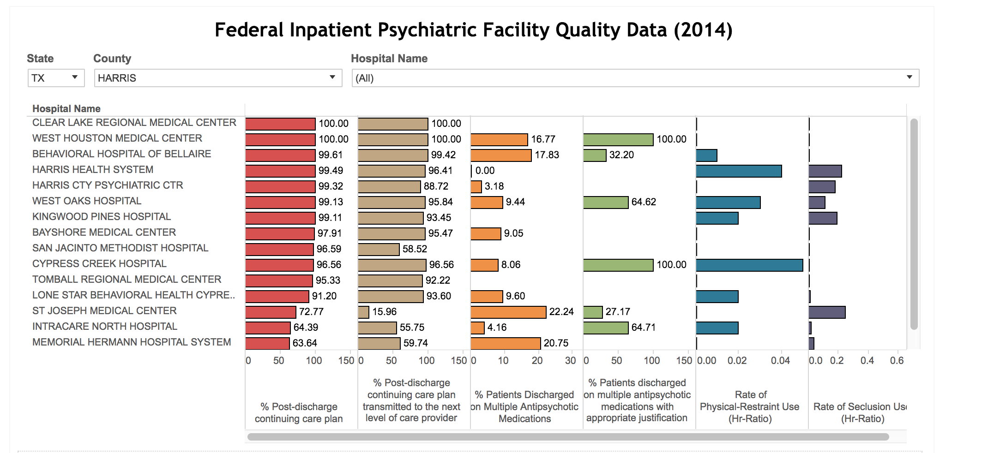
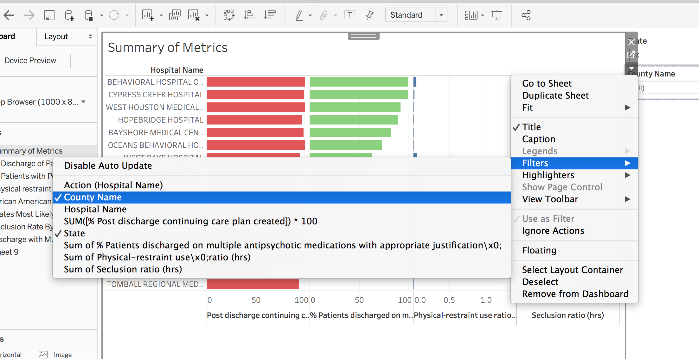
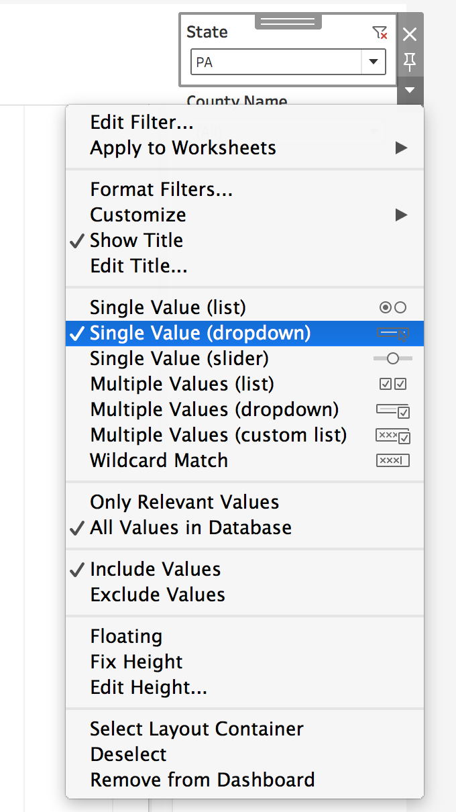
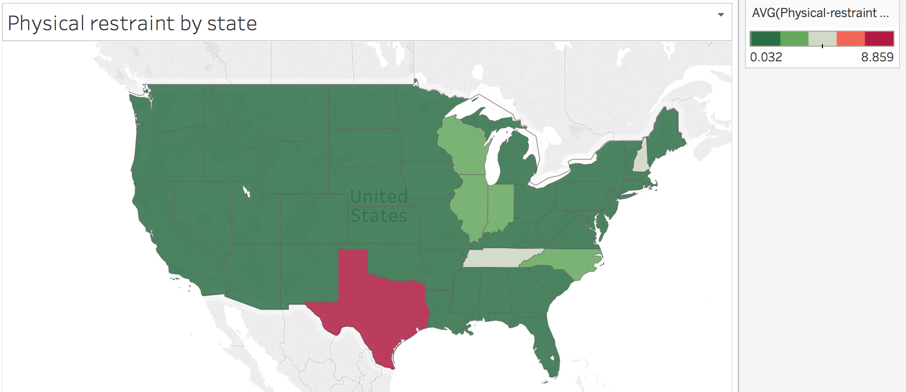
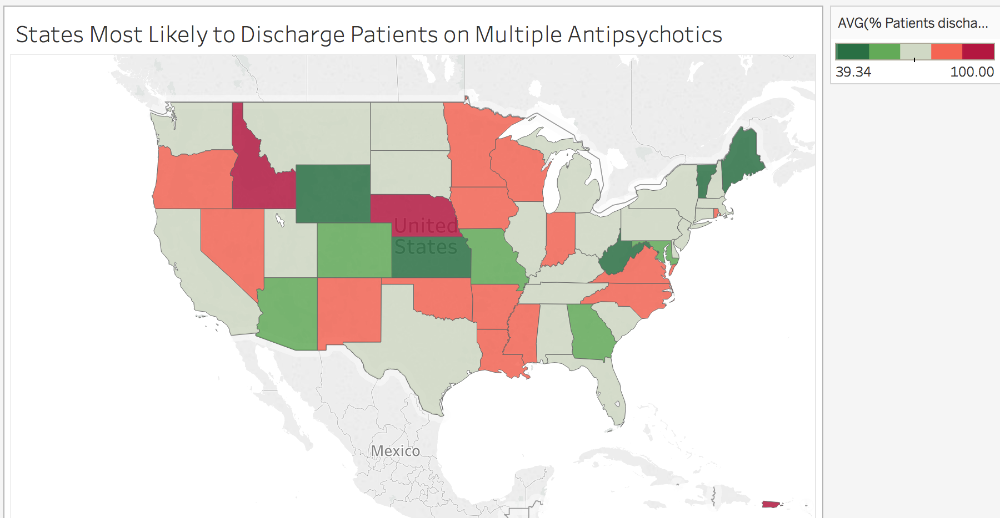
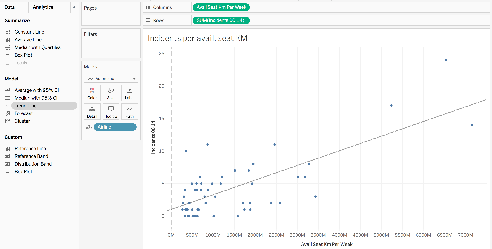
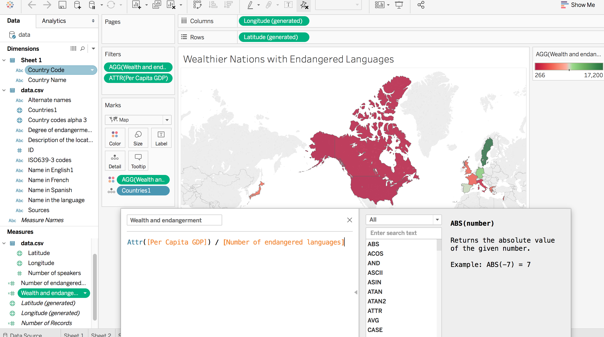

## 20.3 The Answer, My Friend, Is Tableauing in the Wind

### Sample Class Video (Highly Recommended)

* To view an example class lecture visit (Note video may not reflect latest lesson plan): [Class Video](https://codingbootcamp.hosted.panopto.com/Panopto/Pages/Viewer.aspx?id=fcf5ff82-8379-4457-a1b8-a88a00f90fd8)

### Class Objectives

* Students will perform exploratory data analysis using Tableau.
* Students will clean data prior to creating visualizations.
* Students will will create Tableau dashboards.

### 01. Students Do: Psychiatric Health Care (0:30)

* **Instructions**: [Activities/01-Stu_Healthcare/README.md](Activities/01-Stu_Healthcare/README.md)

* In this warm-up activity, students will work with 2014 data on in-patient psychiatric patient care in hospitals across the United States.

* The data set contains information on, among other things:

  * The number of patients who were discharged with a continuing care plan
  * The number of patients who were discharged with multiple anti-psychotic medications
  * The use of physical restraint
  * The use of seclusion

* Students will first have to clean the data, at a minimum fixing the column headings. They will use the included **HBIPS_Measure_Sets.pdf** to accomplish this task.

  * For example, `HBIPS3` in the CSV refers to the use of seclusion, in hours.

* Students should first come up with a dashboard summary that resembles the following.

  

* Afterwards, they will create additional visualizations of their choosing. This activity will focus on data exploration, rather than obtaining pre-defined visualizations. Students are encouraged to come up with interesting and creative visualizations, and they are free to bring additional data sources into the workbook.

* Encourage students to slack out screenshots of interesting visualizations.

### 02. Instructor Do: Review Activity (0:10)

* **File**: [Activities/01-Stu_Healthcare/Solved](Activities/01-Stu_Healthcare/Solved)

* If necessary, take a few minutes to review the basics of creating a dashboard and filters. In the current example, dropdown menus are employed.

  * In the dashboard, click on the downward pointing arrow to access the filters submenu, then choose the filter.

  

  * Then click on the downward pointing arrow in the _filter_ box to choose a dropdown menu.

  

* Also go over the visualizations in the instructor example, as well as visualizations created by students.

  * For example, Texas stands out as a state in which physical restraint is used, or at least reported, more than in other states.

  

  * Nebraska, Idaho, and Puerto Rico stand out as places where patients are likelier to be discharged with multiple antipsychotic medications.

  

### 03. Students Do: Airline Safety (0:15)

* **Instructions**: [Activities/02-Stu_Airline/README.md](Activities/02-Stu_Airline/README.md)

* In this activity, students will explore the safety of the world's airlines. The data set used here is from [fivethirtyeight.com](https://github.com/fivethirtyeight/data/tree/master/airline-safety)

* It will be an open-ended exploration of the data, but some questions to consider might be:

  * What are the safest airlines in the world, and how do we define the idea of safety?
  * Can we group airlines by region to determine whether some regions have better track records than others? What are some possible fallacies of this approach?

### 04. Instructor Do: Review Activity (0:05)

* **File**: [Activities/02-Stu_Airline/Solved/airline.twbx](Activities/02-Stu_Airline/Solved/airline.twbx)

* Spend a few minutes reviewing the activity, and having students share their results.

* As noted in the associated [article](https://fivethirtyeight.com/features/should-travelers-avoid-flying-airlines-that-have-had-crashes-in-the-past/), it may be preferable to take incidents into account, rather than fatalities, as fatalities comprise only a quarter of the total incidents.

* In one of the tabs in the instructor solution, airlines from east and southeast Asia were grouped together in a set, and measured against the rest. The Asian airlines show higher fatalities per available seat kilometer, but it is worth noting that the results amount to a difference of about one in ten million, and it is not immediately clear whether they are statistically significant.

* The last visualization plots the number of incidents against available seat kilometer across all airlines in a scatter plot.

  

  * It appears, as we might predict, that the number of incidents goes up with more miles flown.
  * To create a regression line, click on the `Analytics` tab next to the `Data` tab, and click on `Trend Line`.

- - -

### 05. BREAK (0:40)

- - -

### 06. Students Do: Endangered Languages (0:20)

* **Instructions**: [Activities/03-Stu_Languages/readme.md](Activities/03-Stu_Languages/README.md)

* In this activity, students will be required to visualize data on the world's endangered languages. In addition, they will join additional data to their data set to create extra visualizations.

### 07. Instructor Do: Review Activity (0:10)

* **File**: [Activities/03-Stu_Languages/Solved/languages.twbx](Activities/03-Stu_Languages/Solved/languages.twbx)

* Take a few minutes to review the activity. In the instructor solution, `Countries.csv` is data downloaded from the World Bank. It was joined to the `data.csv` to create the map in the final tab: Wealthier Nations with Endangered Languages.

  

  * A custom field was made to divide a country's per capita GDP by its number of endangered languages. This index is meant to highlight the wealthiest countries with the largest number of endangered languages: in other words, countries that have the greatest responsibility to preserve their dying languages, and have the means to do so.

  * A filter has also been applied to select for countries with a minimum per capita GDP of $15,000 USD.

  * The lower the index, the greater the urgency.

  * The per capita GDP must be made into an attribute.

* Solicit students for any interesting visualizations they might have created, and discuss them.

### 08. Students Do: Mini Project (0:55)

* In this open-ended activity, students will use their Tableau skills to explore data and create visualizations.

* Students will work in pairs or groups of three.

* They must use at least two data sources.

* They may use their previous group projects for inspiration. However, they should not simply replicate their old projects in Tableau.

* When working with data, they may need to clean it with a tool like Pandas before bringing it into Tableau.

* They will give a brief (3-5 minutes) presentation to the class with a summary of their visualizations and findings.

### 09. Students Do: Presentations (0:55)

* Groups will deliver a brief presentation of their findings.

- - -

### LessonPlan & Slideshow Instructor Feedback

* Please click the link which best represents your overall feeling regarding today's class. It will link you to a form which allows you to submit additional (optional) feedback.

* [:heart_eyes: Great](https://www.surveygizmo.com/s3/4381674/DataViz-Instructor-Feedback?section=20.3&lp_useful=great)

* [:grinning: Like](https://www.surveygizmo.com/s3/4381674/DataViz-Instructor-Feedback?section=20.3&lp_useful=like)

* [:neutral_face: Neutral](https://www.surveygizmo.com/s3/4381674/DataViz-Instructor-Feedback?section=20.3&lp_useful=neutral)

* [:confounded: Dislike](https://www.surveygizmo.com/s3/4381674/DataViz-Instructor-Feedback?section=20.3&lp_useful=dislike)

* [:triumph: Not Great](https://www.surveygizmo.com/s3/4381674/DataViz-Instructor-Feedback?section=20.3&lp_useful=not%great)

- - -

### Copyright

Trilogy Education Services © 2018. All Rights Reserved.
